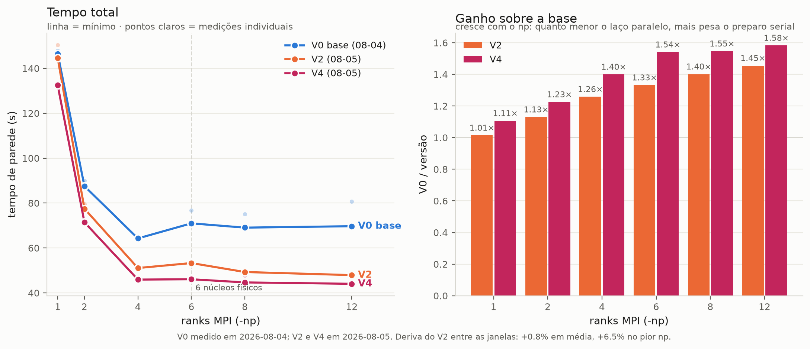
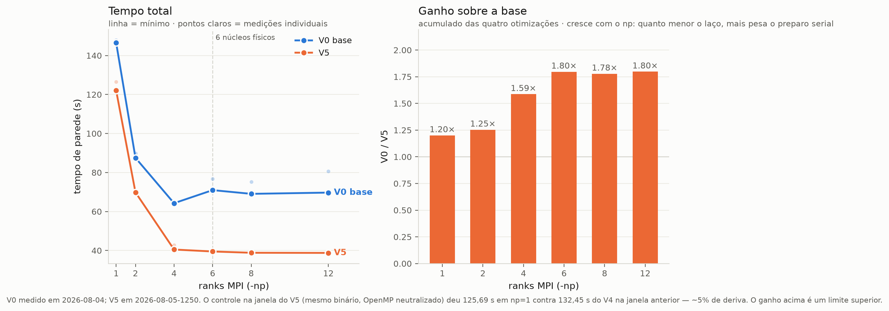

# Otimização do preparo serial do MSCD

Caderno da campanha de otimização do `symtrivert` ("Analyzing/Reanalyzing") e do
resto do preparo serial. Iniciado em 04/08/2026, cluster Ag(111) raio 9 /
profundidade 20, 247 átomos.

---

## COMO CONTINUAR (estado em 05/08/2026, fim da sessão)

### Onde o código está

- **V1, V2 e V4 aplicados e validados.** V1/V2 em
  `mscdrunb_not_reanalize.cpp` (`symtrivert`), **V4 em `mscdrund.cpp:128`**
  (o corte do `tevencut` antes de encher o `csum`). **V3 foi tentado e
  revertido** — ver a seção V3; ficou um comentário no código avisando.
  **O nome V3 está queimado**: a próxima otimização é V5.
- O binário de trabalho está em **build de produção, sem `-DMSCDTIMER`**. Para
  reconstruir com cronômetros de fase e os acumuladores do laço:
  ```bash
  rm -f *.o && make randmscd_parallel \
    CPPFLAGS="-O3 -std=c++98 -w -fpermissive -DMSCDTIMER"
  ```
  Sem a macro não sobra instrução nenhuma. **Com** a macro, o `summation` faz um
  passe extra de histograma na primeira chamada (~1 s) — não use build
  instrumentado para medir tempo total.
- **Binários preservados**, não recompile por cima:
  `baseline/randmscd_parallel.baseline` (V0 original),
  `baseline/randmscd_parallel.v2` e `.v4` (produção, campanha de 05/08).
- Validação de qualquer mudança: `./baseline/regressao.sh [np]` — as 787 linhas
  de intensidade têm de sair idênticas byte a byte. **A base foi regerada em
  05/08/2026** na configuração de k = 13,63 e está válida. A antiga (k = 16) foi
  preservada em `baseline/k16-slab/`.
- **A configuração de física**: `ps01` = `psAg111.txt` (k 13,63, `lnum=20`),
  `ps02` = `psl9.txt`. A anterior está em `Cov0.txt.k16-slab.bak`. **Nenhum
  número medido antes de 04/08/2026 20:47 é comparável com os de depois.**

### Feito: campanha de medição a frio

Rodada em 04/08/2026 20:47, com a configuração corrigida. Resultados na seção
"Escalabilidade". Em uma linha: **`-np 4`, V2 em 49,84 s contra 64,26 s do V0
(1,29×)**, reprodutibilidade de 0,4% nos pontos de `np` baixo.

```bash
./baseline/campanha.sh          # 2 repetições, pausa de 45 s, ~72 min
```

O script embute as precauções que custaram tempo real: aborta se achar outro
`mpirun`/`randmscd` rodando, descarta uma rodada de aquecimento, e pausa entre
medições. Grava `baseline/escala.csv` e chama `baseline/escala.py`, que regenera
`baseline/escalabilidade.png`. **Rodar com a máquina fria** — a campanha limpa
começou com `load 0.04`, e é a isso que se deve a dispersão de 0,4%.

### Próximas ações, nesta ordem

Reordenadas em 05/08/2026 pelo perfil do laço — ver "Perfil do laço paralelo".
Os itens 1 e 2 da lista anterior (regerar a base; instrumentar o laço) **estão
feitos**.

1. **`alldblevent` / `evenelem` — 49,6% do laço, o maior item de longe.**
   `mscdrunc.cpp:753` varre os 40 562 pares distintos chamando `evenelem`
   (`mscdrunc.cpp:22`) até 15 vezes cada; `evenelem` é a soma sobre `l`, e o
   `lnum` dobrou (10 → 20) com a correção do k. **Nada foi tentado aqui ainda** —
   é território virgem e é onde está o tempo.
2. **A cópia `bsum ← asum`** (`mscdrund.cpp:109-117`): os ~199 GB de tráfego que
   o V4 não pegou. Mesmo raciocínio do V4, mas a semântica exige cuidado (as
   entradas não reescritas têm de manter o valor da passada anterior).
3. **Fechar o bug do `phase.cpp`.** `if (i<1) i=1` na linha 313 (o guarda atual é
   código morto) e um limite de iteração nos quatro `while` de 320-325. Hoje o bug
   está sem gatilho, não corrigido — ver "O `np=1` que não terminava".
4. **`pathcut` dentro do `precutable`** — 7,9 s dos ~11 s de preparo serial com a
   máquina leve. Continua sendo o maior item **serial**, mas o serial inteiro é
   ~8% do total agora. **Não otimizar por leitura**: dois palpites já foram
   derrubados pela medição (a fase C, que eu estimei igual à A e era o dobro; e o
   V3, que eu previ mais rápido e ficou 13% mais lento). *(`perf` não está
   instalado nesta máquina — verificado em 04/08/2026.)*
5. **`sendjobs` sem `MPI_Bcast`** (`mscdrun.cpp:502`): envia centenas de MB num
   laço ponto a ponto, custo ∝ número de ranks. 0,97 s com 6, ~10 s projetados
   com 64. É o defeito que mais atrapalha em máquina grande.

### Regras de medição (custaram tempo real para aprender)

Estão em `baseline/README.md`, seção "Como medir sem se enganar". Resumo:
máquina verificadamente vazia antes de medir (`ps -eo args | grep -cE
"^mpirun|^randmscd"` tem de dar 0); nunca dois trabalhos de medição
sobrepostos; só comparar medições da mesma janela; e buffer de saída não é
progresso.

### O que foi decidido e não deve ser refeito sem motivo

- **Eliminar o Reanalyzing**: descartado *após medir*. Com o hash, economiza
  ~0,7 s (1,4%, abaixo do ruído) e exige a parte de maior risco do plano. O
  roteiro está registrado na seção V2 caso volte a valer.
- **`--mca mpi_yield_when_idle 1`**: não ajuda (69,87 s contra 70,42 s).
- **Inverter os laços do pathcut (V3)**: piorou 13%. Não repetir sem medir.

---

Linha de base, critério de validação e medições por fase: **`baseline/README.md`**.
Mapa das equações: `EQUACOES.md`. Arquitetura geral: `README.md`.

## O k errado — achado de física, 04/08/2026

Encontrado ao investigar o travamento do `np=1`, e não tem nada a ver com
otimização: **o programa vinha rodando na energia errada.**

`Cov0.txt` pede k = 13,63 Å⁻¹. O log dizia `16.00 16.00 0.00  kmin kmax kstep`.

A causa é o `kconfine` (`phase.cpp:419`), que eleva o `kmin` até o primeiro ponto
tabelado do phase shift: `if (*kmin<xa) *kmin=xa` com `xa=phasea[0]`. O `ps01`
era `psAg111-slab.txt`, que cobre **k 16,00–18,00** — faixa do Ag 3d, não do
Co 2p. Então o k era levantado em silêncio, sem aviso no log nem código de erro.

Que 13,63 é o valor correto se verifica por dois caminhos independentes:

- **Cinemática.** `linitial=1` ⇒ `"2p"` (`mscdruna.cpp:405`). Co 2p₃∕₂ (BE 778,1
  eV) com Al Kα (1486,6 eV) dá KE = 708,5 eV ⇒ k = 0,512331·√708,5 = **13,637**.
- **O dado experimental.** `Cobalto108.mscd` carrega o k na linha de cabeçalho da
  curva: `1  41  13.6300  18.0000  1.00000  0.00000`. O `18.0` é o theta, que
  bate com `dthetamin=18` do `Cov0.txt`, e as linhas de dados começam em
  `111.000`, que é o `dphimin=111` — a leitura dos campos está confirmada.

Ou seja: cálculo a **975 eV** ajustado contra dado medido a **708 eV**.

E a faixa 16–18 tem dono identificável: Ag 3d₅∕₂ (BE 368,3) com Al Kα dá k =
17,13, no meio do intervalo. O `Cov0.txt` ainda traz `sn  Ag(111)-3d` como nome
do sistema. O arquivo é sobra do experimento de Ag 3d, reaproveitado num
experimento de Co 2p.

**Correção aplicada:** `ps01` passou a `psAg111.txt` — a **mesma prata**, cobrindo
k 5,00–17,75 com 256 pontos e `lnum=20`. Confirmado no log: `13.63 13.63`. A
configuração antiga está em `Cov0.txt.k16-slab.bak`.

Consequências:

- **783 das 787 linhas de intensidade mudaram.** Os `factors` mexeram pouco
  (0.6719 0.8649 → 0.6710 0.8642) porque são fatores de escala do ajuste, não
  observável — **não use `factors` como teste de que a física mudou.**
- `lnum` dobrou (10 → 20): laço paralelo +42%, preparo serial +18%, total +8 a
  17%. Barato pelo que se ganha.
- Com 13,63 no meio da tabela, o `i=0` do `phase.cpp:312` deixa de ser alcançado
  — foi o que parou os travamentos.

**Pendente, decisão de física:** o `ps02` é `psl9.txt`, arquivo genérico
(`1  1 phase shift data`, `lnum=9`), enquanto existe `psCoHCP.txt` de cobalto na
mesma árvore (`~/Ag_Co/theory/`), cobrindo 5,00–17,75. Não foi trocado.

## A regra do jogo

**Toda versão tem de reproduzir as 787 linhas de intensidade byte a byte.**
`./baseline/regressao.sh` verifica. Nenhuma otimização aqui troca precisão por
velocidade — todas eliminam trabalho redundante ou trocam a estrutura de dados,
mantendo a mesma aritmética na mesma ordem.

**Atenção:** a referência do `regressao.sh` foi gerada em k = 16,00, antes da
correção acima. Depois dela nada sai igual àquela referência — **a base tem de
ser regerada** antes de o critério voltar a valer.

Isso não é preciosismo: os laços a jusante percorrem `tevenpar` na ordem do
índice (`mscdrunc.cpp:167,358,462,486`, `mscdrund.cpp:605`) e acumulam em ponto
flutuante. **Reordenar `tevenpar` muda o resultado na última casa.** Por isso
toda versão preserva a ordem exata do original, mesmo quando a ordem em si é
arbitrária.

## O diagnóstico

`symtrivert` não é busca de simetria no sentido de teoria de grupos. É
**deduplicação**: reduzir os `natoms³` trios ordenados (emissor, espalhador₁,
espalhador₂) ao conjunto das assinaturas geométricas distintas
`(r₁, 1/r₂, cos β, espécie)` — 15 069 223 → 823 318 no cluster atual.

A tabela hash é feita à mão, com baldes de capacidade fixa, e tem três fases:

| fase | linhas | o que faz |
|---|---|---|
| **A** | 385-454 | varre `natoms³`, calcula a assinatura, procura no balde por **varredura linear**, insere se não achou |
| **B** | 457-511 | ordena cada balde por (cos β, 1/r₂, r₁) com *selection sort* O(n²) e compacta tudo num array contíguo |
| **C** | 534-575 | varre `natoms³` **de novo**, recalcula a mesma assinatura, e acha o índice final por busca linear no balde |

O "Reanalyzing" é o estouro de um balde: `nsymm/=2`, `ia=ib=ic=natoms+10`, e
**tudo recomeça do zero** (linha 449). No cluster atual acontece 1 vez, ou seja,
metade do trabalho da fase A é retrabalho.

Custo total ≈ `natoms³ × ocupação_do_balde`. Como o número de distintos cresce
mais rápido que `natoms²`, o total escala perto de `natoms³·⁸` — é por isso que
interfaces complicadas explodem.

## Medições

> ⚠ **Esta tabela é da configuração antiga** (`psAg111-slab.txt`, k = 16,00,
> `lnum=10`). Ela continua valendo para o que foi feita — comparar V0/V1/V2 entre
> si, na mesma configuração — mas **os valores absolutos não são os de hoje**.
> Na configuração corrigida (k = 13,63, `lnum=20`) o mesmo preparo serial do V2
> custa ~15,5 s em vez de 13,1 s, com `symtrivert` em 2,50 s e `precutable` em
> 15,64 s. Números atuais na seção "Escalabilidade".

`-np 6`, build com `-DMSCDTIMER`. Tempo em regime, descartando a primeira rodada
(fria). Dispersão entre rodadas: 3% — **ganho abaixo de ~5% é ruído**.

| etapa (rank 0) | V0 base | V1 | V2 |
|---|---:|---:|---:|
| `symtrivert` A — dedup `natoms³` | 6,75 s | 7,43 s | **1,38 s** |
| `symtrivert` B — ordena baldes | 1,02 s | 1,07 s | **0,05 s** |
| `symtrivert` C — indexa `natoms³` | 13,09 s | **0,19 s** | 0,16 s |
| **`symtrivert` total** | **20,87 s** | **8,70 s** | **1,59 s** |
| `symdblvert` | 0,97 s | 0,90 s | 0,92 s |
| `precutable` | 11,20 s | 10,89 s | 9,67 s |
| `sendjobs` | 0,88 s | 0,98 s | 0,94 s |
| **preparo serial** | **33,9 s** | **21,5 s** | **13,1 s** |
| laço dos 779 pontos (paralelo) | 30,7 s | 30,7 s | 30,7 s |
| **total, em regime** | **70 ± 2 s** | **55,6 ± 1,2 s** | **48,4 ± 1,8 s** |
| pico de RSS | 582 MB | 582 MB | 582 MB |

Rodadas: V1 = 55,76 / 54,28 / 56,67 s. V2 = 50,38 / 47,22 / 47,46 s.

**`symtrivert` 20,87 → 1,59 s (13×). Total 70 → 48,4 s (−31%).** Em todas as
versões: curva idêntica byte a byte, `nsymm=1525` e `ntrieven=823318` idênticos.

*(O `ntrieven=823318` também é da configuração antiga. Na atual são **795 605** —
`mscdrunb_not_reanalize.cpp:411` faz `vlenc = kmin/100.0f`, então o `kmin` entra
na largura do bin de deduplicação e a contagem de trios distintos **não é
puramente geométrica**. O `nsymm=1525` não mudou porque não depende do k:
começa em `natoms*natoms/20` = 247²/20 = 3050 e é dividido por 2 no único
Reanalyzing — que é o que o log quer dizer com `Analyzed symmetries for 2 times`.)*

O preparo serial caiu de 48% para 27% do tempo total. O teto de Amdahl subiu de
2,1× para 3,7×.


Figura gerada por `baseline/figura.py` a partir das duas curvas gravadas.
**Resíduo máximo entre V0 e V1: 0 exato**, nos 779 pontos — não é "concordância
dentro da tolerância", é o mesmo número em todos eles.

---

## V1 — fundir a fase C na fase A

**A observação.** As fases A e C percorrem os mesmos 15 milhões de trios e
calculam exatamente a mesma assinatura. A fase A **já descobre** em que slot do
balde cada trio cai — e joga a informação fora:

```c
if (...casou...) j=n+tempadd[m]+10;   // linha 408 do original: o slot é perdido
```

A fase C existe só para redescobrir esse índice, e custa o dobro da A (13,1 s
contra 6,8 s) porque busca em `tevenpar`, cujo passo é de 40 bytes (`[j*10+k]`)
e estoura a L1, enquanto o array da fase A tem passo de 12 bytes.

**A mudança.**

1. `tevenadd` (que já existe e já tem exatamente `natoms³` ints) passa a ser
   alocado **antes** da fase A, e a fase A grava nele o slot de cada trio.
2. Dois arrays novos de `nsymm*tscatter` ints: `origem[]` acompanha de onde veio
   cada entrada enquanto a fase B embaralha os baldes; `destino[]` traduz
   slot-da-fase-A → índice compactado final, preenchido durante a compactação.
3. A fase C vira `tevenadd[n] = destino[tevenadd[n]]` — uma passada de
   remapeamento, sem geometria e sem busca.

**Por que o resultado não muda.** A fase B só permuta entradas; `origem[]`
registra a permutação exata. O conjunto, a ordenação e a compactação continuam
idênticos, byte a byte. O erro 621 (assinatura não encontrada) passa a ser
disparado por `destino[slot] < 0`, que é a mesma condição.

**Custo em memória: nenhum, medido.** Eram esperados +100 MB (os 40 MB de
`origem`+`destino`, mais 60 MB porque `tevenadd` agora convive com `tempar` em
vez de ser alocado depois que ele morre). O pico de RSS não mudou: 582 MB nas
duas versões. O pico do processo é fixado em outro ponto do programa, não aqui.

**O que custou.** A fase A subiu de 6,75 s para 7,43 s (+10%): são 15 milhões de
escritas espalhadas num array de 60 MB, que a versão antiga não fazia. Paga-se
0,7 s na A para economizar 12,9 s na C.

**Resultado medido.** `symtrivert` 20,87 → 8,70 s. Total 70 → 55,6 s, **−20,6%**.
Curva idêntica byte a byte.

**Bug corrigido de brinde.** O original refazia `new tempadd`/`new tempar` a cada
Reanalyzing **sem liberar os anteriores** (linha 381): ~130 MB vazados por volta.
Agora libera antes de realocar.

---

## V2 — hash de verdade na fase A, `std::sort` na fase B

Feito. **Fase A 7,43 → 1,38 s. Fase B 1,07 → 0,05 s.** Curva idêntica.

### O que foi feito

**V2a — hash no lugar da varredura linear (fase A).** A busca `for (j=n;
j<n+tempadd[m]; ++j)` percorria o balde inteiro — em média ~270 comparações por
trio, 15 milhões de vezes. Trocada por sondagem linear numa tabela de
endereçamento aberto.

Duas coisas tornam o hash **exato**, não aproximado:

1. As três chaves já chegam quantizadas (`round(...,0.005f)` e
   `round(...,vlenc)`), então padrão de bits idêntico ⟺ valores iguais, que é
   exatamente a comparação `==` que o original faz.
2. Única armadilha: `-0.0f` e `+0.0f` são `==` mas têm bits diferentes. Sem
   normalizar, o mesmo valor entraria duas vezes. `mscd_chave()` normaliza.

**A correção de rota que o código me obrigou a fazer.** Meu plano dizia que o
conjunto distinto não dependia de `nsymm`. Está errado, e a leitura atenta da
linha 424 mostra por quê: o balde é escolhido com `search`, que **inclui
`akind`** (a espécie do átomo do meio), mas a chave guardada em `tempar` é só
`(lena, vlenb, cosbeta)`. Duas espécies com a mesma geometria caem em baldes
diferentes e são **duas entradas distintas** no original. Por isso a chave do
hash inclui o balde `m` — sem isso elas seriam fundidas e a física mudaria.

O balde de uma entrada é recuperado de graça do próprio slot (`j/tscatter`), sem
array extra.

**V2b — `std::sort` na fase B.** Eram três *selection sorts* encadeados, O(n²)
cada, para chegar na ordem lexicográfica por (cos β, 1/r₂, r₁). `std::sort` dá o
mesmo resultado porque dentro do balde as três chaves juntas são únicas (a dedup
garante): a ordem total é a mesma e não há empate para desempatar. 20× mais
rápido.

### O que **não** foi feito, e por quê

**O Reanalyzing continua lá** — `Analyzed symmetries for 2 times`. A eliminação
dele estava no plano, e foi descartada depois de medir: com o hash, a passada
inteira da fase A custa ~0,7 s, então matar o retrabalho economiza ~0,7 s. Isso
é 1,4% do total, abaixo do ruído de medição, e exigiria prever o `nsymm` final
por simulação da regra de halving — a parte de maior risco de todo o plano, com
três modos de falha listados abaixo. **Não vale a troca.** Ficou registrado
porque volta a valer se o custo por passada crescer muito com o tamanho do
cluster.

Se um dia for feito, o roteiro é: (1) uma passada com hash sem capacidade fixa;
(2) achar o `nsymm` final simulando a regra original sobre as ~823 mil
assinaturas distintas em vez dos 15 milhões de trios — `nsymm = natoms²/20`,
`tscatter = mscatter/nsymm/3`, halving enquanto algum balde tiver contagem
`> tscatter`, mais a regra `if (nsymm<10 && mscatter<=5*natoms³)
mscatter=mscatter*3/2`; (3) montar o layout e remapear. Riscos, em ordem: a
ordem final tem de bater com a da compactação (linhas 493-511, onde o teste
`tempar[p*3]==0.0` faz dupla função de "consumida" e "comprimento zero"); o
`nsymm` simulado tem de bater com o do original; e a contagem por balde tem de
ser a de chaves `(l,v,c)` distintas, não a de entradas.

### Custo

+34 MB de tabela hash (dimensionada estritamente maior que o número de slots,
para que uma sondagem sem sucesso nunca entre em laço infinito). Pico de RSS
medido: **inalterado**, 582 MB — o pico do processo é fixado em outro ponto.

---

## Rascunho do plano original do V2 (mantido como registro)

Ataca A (6,75 s) e B (1,02 s) de uma vez. Depende do V1 estar fechado.

> **Este trecho contém um erro**, mantido de propósito porque a correção é o
> achado mais importante do V2: o conjunto distinto **depende** de `nsymm`,
> porque o balde é escolhido usando `akind`, que não faz parte da chave
> guardada. Ver a seção do V2 acima.

**A chave do problema.** O índice do balde `m` é **função pura da assinatura**
(linhas 401-404): assinaturas iguais caem sempre no mesmo balde, para qualquer
`nsymm`. Logo **o conjunto distinto não depende de `nsymm`**. Isso é o que
permite separar duas coisas que hoje estão amarradas: *descobrir quais são os
distintos* (caro, `natoms³`) e *escolher o `nsymm` e arrumar os baldes* (barato,
823 mil itens).

**O segundo fato que destrava.** Todas as três chaves são quantizadas antes de
comparar — `round(...,0.005f)` nas linhas 390/400/402 e `vlenc = kmin/100`. Chave
quantizada é inteiro exato, então dá para hashear com igualdade **idêntica** à
comparação de floats que o código faz hoje. O hash não é aproximação.

**O algoritmo.**

1. **Uma** passada sobre `natoms³` com hash de endereçamento aberto sobre
   `(lena, vlenb, cosbeta)` convertidos a inteiro. Sem capacidade fixa, logo sem
   estouro e **sem Reanalyzing**. Guarda o id da assinatura em `tevenadd` (como
   no V1). Custo por trio: ~1 sonda em vez de ~270 comparações.
2. **Descobrir o `nsymm` final** simulando a regra original sobre as 823 mil
   assinaturas distintas — não sobre os 15 milhões de trios:
   - começa em `nsymm = natoms²/20`;
   - `tscatter = mscatter/nsymm/3`;
   - conta quantos distintos caem em cada balde (recalcular `m` para 823 mil
     itens é barato);
   - se algum balde tem contagem `> tscatter`, então `nsymm/=2` (mais a regra de
     crescimento `if (nsymm<10 && mscatter<=5*natoms³) mscatter=mscatter*3/2`) e
     repete.

   Isso reproduz **exatamente** o `nsymm` a que o original converge. A
   equivalência vale porque o original dispara o estouro quando a contagem
   ultrapassa `tscatter` durante a inserção, e contagem final `> tscatter` ⟺
   ultrapassou em algum momento.
3. **Montar o layout** no `nsymm` final: ordenar cada balde por
   (cos β, 1/r₂, r₁) e concatenar na ordem `m = 1..nsymm-1`. Isso é exatamente o
   que as fases B produzem hoje — verificado relendo a compactação das linhas
   493-511, que emite as entradas na ordem ordenada. Trocar o *selection sort*
   O(n²) por `std::sort` com o mesmo comparador de 3 chaves.
4. **Remapear `tevenadd`**, como no V1.

**Onde isso pode dar errado, em ordem de risco.**

- A ordem final tem de bater com a do original. O ponto delicado é a
  compactação (linhas 493-511), que parece emitir na ordem ordenada mas tem o
  teste `tempar[p*3]==0.0` fazendo dupla função de "entrada consumida" e
  "comprimento zero". Conferir com um dump comparativo de `tevenpar` antes de
  confiar.
- Empates: dentro de um balde as três chaves juntas são únicas (a dedup
  garante), então `std::sort` não precisa ser estável.
- Se `nsymm` simulado não bater com o do original, o layout muda e a curva muda.
  Instrumentar e comparar `nsymm` e `ntrieven` antes de comparar a curva.

---

## Escalabilidade — V0 contra V2

Campanha fria de 04/08/2026, 20:47 (`baseline/campanha.sh`, `REPS=2 PAUSA=45`,
load 0,04 ao iniciar): `np` = 1, 2, 4, 6, 8, 12, duas versões, duas repetições,
**intercaladas dentro de cada `np`** para que deriva térmica atinja as duas
igualmente e a razão entre elas se preserve. Tabela pelo **mínimo** das
repetições (estimador padrão em benchmark: ruído só atrasa, nunca acelera).
Dados brutos em `baseline/escala.csv`, figura em `baseline/escalabilidade.png`
(`baseline/escala.py`).

**Estes números são da configuração corrigida** — `psAg111.txt`, k = 13,63 Å⁻¹,
`lnum=20` (ver "O k errado"). **Não são comparáveis** com os de qualquer versão
anterior deste arquivo, que foram medidos em k = 16,00 com `lnum=10`. O custo da
correção, medido no V2: 116,06 → 135,65 s em `np=1`, 46,24 → 49,84 s em `np=4`.

| `np` | V0 | V2 | ganho | speedup V0 | speedup V2 |
|---:|---:|---:|---:|---:|---:|
| 1 | 146,49 s | 135,65 s | 1,08× | 1,00× | 1,00× |
| 2 | 87,53 s | 73,91 s | 1,18× | 1,67× | 1,84× |
| 4 | **64,26 s** | **49,84 s** | 1,29× | **2,28×** | **2,72×** |
| 6 | 70,97 s | 53,28 s | 1,33× | 2,06× | 2,55× |
| 8 | 69,06 s | 51,89 s | 1,33× | 2,12× | 2,61× |
| 12 | 69,70 s | 49,86 s | **1,40×** | 2,10× | 2,72× |

**`factors = 0.6710 0.8642` nas 24 rodadas**, nas duas versões e em todos os
`np`. É a validação mais forte que temos: o resultado não depende nem da versão
nem do número de ranks.

Três leituras:

- **O ótimo é `np=4`, não `np=6`.** O `np=4` ganha do `np=6` nos **quatro
  pareamentos independentes** (V0 rep1 64,26 vs 76,77; V0 rep2 64,54 vs 70,97;
  V2 rep1 49,84 vs 53,28; V2 rep2 51,83 vs 55,81), com margem de 7% a 16%. O
  `np=12` empata com o `np=4` no mínimo (49,86 vs 49,84) mas com dispersão muito
  pior no V0 — 15,7% entre repetições contra 0,4% do `np=4`. **Use `-np 4`.**
- **O ganho do V2 cresce com o `np`**: 1,08× em `np=1` contra 1,40× em `np=12`.
  É o argumento central: quanto mais o laço paralelo encolhe, mais o preparo
  serial domina — e é exatamente ele que o V2 cortou. **Otimizar o serial é o que
  permite usar máquina grande.**
- **O gargalo mudou de lugar, e isto redireciona o próximo passo.** O preparo
  serial do V2 é 15,5 s em 135,65 s de `np=1`, ou seja 11,4% ⇒ teto de Amdahl
  **8,8×**. O medido é 2,72×. A diferença não está mais no serial: o laço
  paralelo sozinho vai de ~120 s (`np=1`) para 35,6 s (`np=6`, cronometrado no
  piloto), **3,4× com 6 ranks — 56% de eficiência**. Continuar cortando serial
  rende pouco agora; o alvo passou a ser por que o laço perde 44%.
  *(Derivado de um `np=6` instrumentado mais o total de `np=1`, não de uma
  medição dedicada por `np`. Confirmar antes de agir.)*

### Qualidade destes números

A dispersão entre repetições **cresce com o `np`**, o que faz sentido com 12
threads sobre 6 núcleos físicos:

| `np` | 1 | 2 | 4 | 6 | 8 | 12 |
|---|---:|---:|---:|---:|---:|---:|
| V0 | 1,0% | 2,7% | 0,4% | 8,2% | 8,8% | 15,7% |
| V2 | 0,4% | 1,8% | 4,0% | 4,7% | 7,0% | 1,6% |

Até `np=4` a reprodutibilidade é de fração de por cento — o `V0 np=1` deu 147,93
e 146,49 s. Compare com a campanha suja anterior, onde o mesmo ponto ia de 71,4
para 107,5 s: **o resfriamento inicial e as pausas de 45 s resolveram a deriva.**
Nos pontos de `np` alto a dispersão é real e a curva ali deve ser lida com essa
margem, não como valor exato.

### O `np=1` que não terminava — era bug, não contenção

Uma rodada de `np=1` do V0 passou **897 s sem terminar**, e este arquivo dizia
que era **contenção de CPU** (897/150 = 6,0×, "exatamente o que se espera de um
processo disputando 6 núcleos"). **Esse diagnóstico estava errado**, e a razão
por que sobreviveu é que a aritmética fechava bonito.

Em 04/08/2026 o travamento reapareceu, com a máquina **verificadamente vazia**
(`load 1.00` = só o processo, 5,6 GB livres, `VmSwap: 0`, `read_bytes: 832`).
Ficou 52 min em `R` a 100% de CPU sem escrever uma linha. Diagnóstico real, com
o `rip` colhido por `gdb -p` e conferido no *disassembly*: laço infinito em
**`phase.cpp:320`**, `while (xc-xb>90.0) xc-=180.0f`.

A cadeia, com a parte provada separada da inferida:

1. **Provado.** `phase.cpp:164` zera as 256×61 posições de `phasea`, então valor
   *de dentro* do array é da tabela (graus, ±180) ou zero — com ambos limitados o
   laço termina em ≤2 iterações, **sempre**. Logo o índice tinha de estar fora, e
   só existe um candidato: `(i-1)*61+j+1` com `i=0`, que dá −60..−51.
2. **Provado.** `phase.cpp:312-313` permite `i=0`: o guarda `if (i<0) i=0` é
   código morto, porque `i` nunca sai negativo daquele `for`. A intenção era
   `if (i<1) i=1`.
3. **Provado.** `rip = makephase+0x110`, um laço de 5 instruções
   (`subss`/`movaps`/`subss`/`comiss 90.0`/`ja`) — é a linha 320 compilada.
   Base PIE confere: `0x5ac4142fd5d0 − 0x2a5d0 = 0x5ac4142d3000`.
4. **Provado.** Com `xb` grande negativo, `xc` decrementa 180 por iteração até a
   precisão do `float` saturar (~3e9, onde `xc-180 == xc`) e **nunca termina**.
5. **Inferido.** `phasea` é `float*`; `phasea[-60]` cai ~240 bytes antes do bloco
   do `malloc`. Página nova do kernel vem zerada (caso comum ⇒ roda normal, e daí
   `factors` sair sempre igual); reuso de chunk sujo ⇒ valor grande ⇒ trava. A
   variação vem do Open MPI, que aloca em 3 threads com tempo indeterminado. Não
   foi possível ler a memória do processo travado sem root.

O gatilho era de configuração e está corrigido — ver "O k errado". Com
`psAg111.txt` o `i=0` deixa de ser alcançado no caso normal (13,63 fica com 8,6
Å⁻¹ de margem abaixo do início da tabela, em vez de zero), e o `np=1` rodou três
vezes na campanha fria sem repetir. **Mas o bug continua no código**: a correção
mínima é `if (i<1) i=1` na linha 313, e os quatro `while` de 320-325 seguem sem
limite de iteração.

Três erros de método que geraram isso, todos fáceis de repetir:

1. **Aceitar a explicação cuja aritmética fecha.** 897/150 = 6,0× com 6 núcleos é
   coincidência convincente, e foi ela que fechou a investigação cedo. Número
   redondo não é evidência causal.
2. **Não amostrar a pilha do processo vivo.** Custa 5 s (`gdb -p PID -batch -ex
   "bt 25"`), decide a questão, e a evidência morre com o processo. Precisa de
   `sudo` neste sistema: `ptrace_scope=1` só permite rastrear descendente.
3. **Tomar buffer de saída por progresso.** O `stdout` redirecionado é
   bufferizado em bloco, então o arquivo fica atrás do programa. Aqui isso
   *escondeu* o travamento de verdade: as "24 linhas paradas em 0,00%" foram
   descartadas como artefato de buffer quando eram sintoma real.

Vale para o `precutable` e para qualquer medição futura: **medir com a máquina
quieta, reproduzir antes de concluir, e amostrar a pilha antes de matar.**

## Perfil do `precutable` — o próximo alvo

Instrumentado em 6 pontos (`mscdrunc.cpp`, mesma macro `MSCDT`). Curva idêntica.

| trecho | tempo | |
|---|---:|---|
| coeficientes vibracionais | 0,001 s | |
| matrizes de rotação | 0,003 s | |
| expansão esférica + cortes | 0,058 s | |
| `alltrievent(1,kmin)` | 1,362 s | elementos de matriz de espalhamento |
| **laço do pathcut** | **8,615 s** | **82% do `precutable`** |
| estatísticas + alocações | 0,440 s | |
| **total** | **10,479 s** | |

O laço é `mscdrunc.cpp:404-462`: `for m=2..msorder { for ib { for ic { for ia`,
ou seja **7 × 247³ = 105 milhões de iterações**. Por (ib,ic) ele reduz sobre `ia`
— `xa` por máximo, `cxa` por soma — e no fim grava `bsum[ib*natoms+ic]`.

Três coisas visíveis na leitura, em ordem de ganho esperado:

1. **A ordem dos laços é a pior possível.** O índice é
   `id = ia*natoms² + ib*natoms + ic`, mas `ia` é o laço **mais interno**: cada
   passo de `ia` salta `natoms²` = 244 KB dentro de `tevenadd` (60 MB), e o mesmo
   vale para `tevendim[id]`. São 105 milhões de acessos praticamente aleatórios.
   Com `ia` no laço externo o acesso vira sequencial.

   **E a troca é segura**: `ia` é o índice da redução, `(ib,ic)` é o da saída.
   Basta manter acumuladores `xa[]`/`cxa[]` de tamanho `natoms²` (~0,7 MB) e
   adiar a escrita de `bsum`. A soma de `cxa` para cada `(ib,ic)` continua na
   mesma ordem de `ia`, então **o resultado em ponto flutuante não muda** — que
   é a condição para a curva continuar idêntica. `xa` é máximo, indiferente à
   ordem. E `bsum` não é lido dentro do laço (só `asum`, que é a cópia da
   iteração anterior de `m`), então adiar a escrita não cria dependência.

2. **`cabs(asum[ia*natoms+ib])` aparece 5 vezes com o mesmo argumento** (linhas
   421-425), uma raiz quadrada cada. O compilador provavelmente já faz a
   eliminação de subexpressão comum com `-O3`; medir antes de mexer.

3. **`xb`..`xf` são calculados sempre, mas usados numa cascata de `else if`.**
   Com `raorder=4` (o valor do `Cov0.txt`), o primeiro teste é sobre `xf`; se ele
   passa, os outros quatro produtos foram jogados fora. Calcular sob demanda
   economiza ~4 multiplicações por iteração, 105 milhões de vezes.

Nada disso é paralelismo — é a mesma família de correção algorítmica do V1/V2.

## V3 — inverter a ordem dos laços do pathcut: **piorou, foi revertido**

Resultado negativo, medido e mantido no registro porque a intuição que ele
derruba é forte e voltaria a aparecer.

**A hipótese.** O laço do pathcut (`mscdrunc.cpp:404-465`) é
`for m { for ib { for ic { for ia`, e o índice é `id = ia*natoms² + ib*natoms + ic`.
Com `ia` no laço **mais interno**, cada passo salta `natoms²` = 244 KB dentro de
`tevenadd` e `tevendim` (60 MB cada). Parecia o caso clássico de ordem de laço
errada: inverter para `(ia,ib,ic)` deixaria o acesso sequencial em `ic`.

**A transformação é válida.** `ia` é o índice da redução e `(ib,ic)` o da saída,
então basta manter acumuladores de tamanho `natoms²` e adiar a escrita de `bsum`.
Para cada `(ib,ic)` a soma de `cxa` continua percorrendo `ia` em ordem crescente,
logo a aritmética de ponto flutuante é a mesma; `xa` é máximo, indiferente à
ordem; e `bsum` não é lido dentro do laço (só `asum`, cópia do `m` anterior).
**A curva saiu idêntica byte a byte** — a transformação está correta.

**Mas ficou mais lento.** Comparando medições feitas próximas uma da outra, com
a máquina no mesmo estado — que é a única comparação defensável aqui:

| laço do pathcut | |
|---|---:|
| V3 (`ia` externo) | 10,930 s |
| revertido (`ia` interno) | 9,669 s |

**13% mais lento**, e o `precutable` inteiro de 11,55 s para 12,85 s.

⚠️ **Não compare com os 8,615 s da tabela do V2**: aquilo foi medido ~2 h antes,
com a máquina fria. Depois de carga contínua ela entrega ~15% menos — o mesmo
`-np 6` que dava 48,4 s passou a dar 56,5 s **sem mudança de código**. Os números
de fase só são comparáveis entre si dentro da mesma janela de medição.

**Por quê.** Na versão original `xa` e `cxa` vivem em **registrador** durante todo
o laço de `ia`. Com `ia` por fora eles viram acumuladores em memória, e cada uma
das 105 milhões de iterações passa a fazer load+store. O custo disso superou o
ganho de localidade — ou seja, **o laço não era dominado pelo passo de 244 KB**,
ao contrário do que eu supus. Os acessos que realmente pesam são provavelmente os
dependentes de dado (`tevenpar[k*10+…]`, `tevenelem[memadd+…]`, com
`k=tevenadd[id]`), que a inversão não muda.

**Revertido.** Ficou um comentário no código avisando para não repetir a
tentativa sem medir.

**A lição para o próximo passo:** parar de otimizar por hipótese de leitura. O
`precutable` precisa de **profiling de verdade** — contadores de cache miss e de
stall (`perf stat -e cache-misses,LLC-load-misses`) — para dizer onde o tempo vai
antes de qualquer nova transformação. Foi o segundo palpite meu que a medição
derrubou (o primeiro foi ter estimado a fase C igual à A, quando era o dobro).

## Perfil do laço paralelo — 05/08/2026

Até aqui todo o esforço foi no preparo serial, e o laço dos 779 pontos era uma
caixa preta de ~120 s. Instrumentado por dentro (`mscdtimer.h` ganhou
acumuladores; um `fprintf` por chamada custaria mais que a região medida, porque
`summation` roda 3895 vezes).

`-np 1`, build com `-DMSCDTIMER`. Os acumuladores somam 148,26 s contra os
148,76 s do cronômetro do laço: **99,7% do tempo explicado**.

| bloco | tempo | % do laço | chamadas reais |
|---|---:|---:|---:|
| **`alldblevent`** (`mscdrunc.cpp:753`) | **73,58 s** | **49,6%** | 779 |
| `summation` — laço de `m` | 48,10 s | 32,4% | 3895 |
| `summation` — bloco final (`onevenemit`) | 12,25 s | 8,3% | 3895 |
| `allevendetec` | 10,07 s | 6,8% | 3895 |
| `summation` — init do `asum` | 4,26 s | 2,9% | 3895 |
| `thetainside` | 0,003 s | 0,0% | 3895 |

*(Rodada com a máquina carregada — 171,4 s de wall contra 135,65 s da campanha
fria. Os absolutos estão inflados; as proporções valem. Na mesma rodada o
`symtrivert` deu 2,72 s e o `pathcut` 16,34 s, contra 1,37 s e 7,88 s medidos
depois com a máquina leve: **a carga quase dobra as fases seriais**.)*

### O laço de `m` quase não calcula física

Histograma do `evedim`, medido uma vez (as máscaras do `pathcut` não mudam entre
direções porque `kmin==kmax`, então a energia é constante na corrida inteira):

```
visitas potenciais (m,ia,ib,ic)     90 231 570
  podados por tevencut (par ia,ib)  90 110 787   99,87%
  podados por evedim<1 ou ic==ib       119 328    0,13%
  evedim= 1    762 trios        762 MACs
  evedim= 3    625 trios      5 625 MACs
  evedim= 6     17 trios        612 MACs
  evedim=10     30 trios      3 000 MACs
  evedim=15     21 trios      4 725 MACs
```

**Sobrevivem 1 455 trios, com 14 724 MACs no total.** Isso é trabalho de
microssegundos. Os 48 s do laço de `m` são portanto **tráfego de memória, não
conta** — duas cópias grandes por chamada:

- `bsum ← asum` (`mscdrund.cpp:109-117`): 7 passadas × 247 × 246 × 15 complexos
  = 51 MB por chamada de `summation`
- o preenchimento do `csum` a partir de `devendetec`: outros 51 MB por chamada

× 3895 chamadas ≈ **400 GB de tráfego para produzir 14 724 multiplicações**. A
8,3 GB/s isso dá exatamente os 48 s medidos.

### Consequências

1. **A prioridade mudou de novo.** O alvo é o `alldblevent`, 49,6% sozinho — não
   o laço de `m`, que eu tinha suposto ser o núcleo.
2. **Para GPU, o alvo natural é o `evenelem`** (`mscdrunc.cpp:22`), a soma sobre
   `l` que o `alldblevent` chama até 15 vezes para cada um dos 40 562 pares
   distintos: tarefas independentes, aritmética densa, escrita coalescida, e as
   tabelas consultadas (deslocamento de fase, Hankel, harmônicos) são pequenas.
   A hipótese anterior — de que a divergência de `evedim` seria o problema na
   GPU — **está errada**: com 1 455 trios não há trabalho para divergir.
3. **Explica o custo da correção do k.** `alnum` vem do `lnum`, que subiu de 10
   para 20 com o `psAg111.txt`; o laço de `l` do `evenelem` dobrou. É a mecânica
   por trás dos 116,06 → 135,65 s que estavam registrados sem explicação.
4. **`makephase` não é problema**, ao contrário do que a estrutura sugere:
   `getalnum` → `makephase` é chamado por `evenelem`, mas `phase.cpp:310` tem
   cache (`if (xa>1.0e-3)`) e com `akin` constante o cache sempre acerta.

Medido também: **`MAXRSS` = 313 MB** por rank (`/usr/bin/time -f %M`, `np=1`).
O valor de 582 MB da tabela de medições acima é da configuração antiga.

## V4 — o corte do `tevencut` antes de encher o `csum`

Consequência direta do perfil. Em `mscdrund.cpp` a ordem era:

```cpp
for (j=0;j<radim;++j)                 // 15 leituras de devendetec
{ id=ia*natoms*radim+ib*radim+j;
  csum[j]=devendetec[id];
}
if (tevencut[(m-1)*natoms*natoms+ia*natoms+ib]==0) continue;   // 99,87% saem aqui
```

O `csum` era preenchido **antes** do teste e só é usado depois dele — dentro do
laço de `ic` e na escrita de volta, ambos pulados pelo `continue`. Trocar a ordem
é exatamente equivalente e elimina ~199 GB dos ~400 GB de tráfego.

**Não é o V3.** O V3 é a inversão dos laços do `pathcut`, que piorou 13% e foi
revertida (seção acima). O nome está ocupado; esta é a V4.

### Medição, com controle interno

Duas rodadas `-np 1` instrumentadas. O `alldblevent` **não foi tocado**, então
serve de controle para a diferença de carga entre as duas:

| bloco | V2 | V4 | |
|---|---:|---:|---|
| `alldblevent` (**controle**) | 73,58 s | 71,14 s | −3,3% |
| **laço de `m`** | 48,10 s | **27,60 s** | **−42,6%** |
| bloco final | 12,25 s | 11,22 s | −8,4% |
| `allevendetec` | 10,07 s | 10,95 s | +8,7% |
| init do `asum` | 4,26 s | 3,89 s | −8,7% |
| **soma do laço** | **148,26 s** | **124,80 s** | **−15,8%** |

A máquina variou 3,3% (medido no código intocado) enquanto o laço de `m` caiu
43%: **o ganho é real, ~20,5 s de um laço de 148 s.**

**Validação:** `./baseline/regressao.sh 1` → `IDENTICA byte a byte OK`, com
`factors = 0.6710 0.8642`. Era o esperado: a mudança é de ordem de execução, não
de aritmética.

### Campanha V2 × V4 — 05/08/2026

`baseline/campanha-v4.sh`, 2 repetições, pausa de 45 s, load 1,06 ao iniciar.
**Os dois binários saem da mesma build de produção, sem `-DMSCDTIMER`**
(`baseline/randmscd_parallel.v2` e `.v4`) — o V2 foi remedido de propósito, porque
os pontos de 04/08 vieram de binário com cronômetros e de outra janela térmica.
`factors = 0.6710 0.8642` nas 24 rodadas.

| `np` | V0 (04/08) | V2 (05/08) | V4 (05/08) | V4 sobre V2 | V4 sobre V0 |
|---:|---:|---:|---:|---:|---:|
| 1 | 146,49 s | 144,52 s | 132,45 s | 1,09× | 1,11× |
| 2 | 87,53 s | 77,49 s | 71,45 s | 1,09× | 1,23× |
| 4 | 64,26 s | 51,07 s | 45,93 s | 1,11× | 1,40× |
| 6 | 70,97 s | 53,29 s | 46,08 s | **1,16×** | 1,54× |
| 8 | 69,06 s | 49,30 s | 44,67 s | 1,10× | 1,55× |
| 12 | 69,70 s | 47,92 s | **44,05 s** | 1,09× | **1,58×** |

**Deriva do V2 entre as duas janelas: +0,8% em média, +6,5% no pior `np`.** É
pequena, então comparar o V4 de hoje com o V0 de ontem é defensável — mas a
coluna "V4 sobre V0" carrega essa margem, e a de `np=1` é a mais suspeita
(+6,5%).

### O `np` ótimo mudou de lugar — e a conclusão anterior era forte demais

Nesta janela, para **as duas versões e as duas repetições**, a ordem é
`np=12 < np=8 < np=4 < np=6`. O `np=12` ganha do `np=4` nos quatro pareamentos
independentes — que é **exatamente o argumento que foi usado em 04/08 para
concluir o contrário**, quando o `np=4` ganhava nos quatro.

O que sobrevive às duas janelas:

- **`np=1` e `np=2` são claramente piores.** Robusto.
- **`np=6` é consistentemente o pior de {4, 6, 8, 12}** — V2 deu 53,28 s em
  04/08 e 53,29 s em 05/08. Robusto, e curioso: é justamente o número de núcleos
  físicos.
- **Entre `np=4`, `8` e `12` a ordem inverte entre janelas**, e a diferença
  (~6%) é do mesmo tamanho da deriva medida. **Não é uma propriedade estável da
  máquina.**

Conclusão honesta: **use `np ≥ 4` e evite `np=6`**. A recomendação anterior de
"use `-np 4`, ganha nos quatro pareamentos, então não é ruído" estava
**correta dentro daquela janela e errada como regra geral** — o teste de
pareamento detecta ordenação dentro de uma janela, não a estabilidade dela entre
janelas. Para afirmar um ótimo seria preciso repetir a campanha em dias
diferentes, o que não foi feito.



### A outra metade

A cópia `bsum ← asum` é os outros ~199 GB. Pelo mesmo raciocínio ela é quase toda
desnecessária — só as entradas `(ib,ic)` efetivamente lidas importam, e são
poucas. Mas a semântica exige cuidado (as entradas não reescritas têm de manter o
valor da passada anterior), então não é troca de uma linha. **Não tentado ainda.**

## V5 — OpenMP no `pathcut`

Feito em 05/08/2026, na sessão do port de GPU. **A curva sai idêntica byte a
byte**; o efeito no tempo *total* ainda não foi medido em campanha (ver
"Pendente" no fim da seção).

### Primeiro, o preparo serial foi cronometrado inteiro

Faltavam marcas em `maketripar`, `makedblpar` e `allrotation` — foram
acrescentadas em `mscdrund.cpp:257-263`. `np=1`, build `-DMSCDTIMER`, máquina
leve (`load 0.45`, nenhum outro job):

| etapa serial | tempo | % do preparo |
|---|---:|---:|
| **laço do `pathcut`** | **7,134 s** | **66%** |
| `symtrivert` (A+B+C+D) | 1,280 s | 12% |
| `alltrievent` | 1,181 s | 11% |
| `symdblvert` | 0,797 s | 7% |
| `allrotation` (`natoms³`) | 0,151 s | 1,4% |
| `maketripar`+`makedblpar`+resto | 0,29 s | 3% |
| **total** | **~10,8 s** | |

Duas coisas caíram aqui:

- **`allrotation` não é gargalo.** São 15 milhões de iterações com `atan2`,
  `acos` e `sqrt`, e a suspeita era de que custasse segundos. **0,151 s.** O
  guarda `if (eledim<2)` (`mscdrunc.cpp:742`) poda quase tudo antes da
  trigonometria. Hipótese testada e descartada — não volte a ela.
- **O cronômetro do `pathcut` media duas varreduras.** Entre o
  `MSCDT("precut alltrievent")` e o `MSCDT("precut pathcut")` havia também o
  laço do máximo do `pemeven` (`mscdrunc.cpp:381-396`, `natoms³`). Foi separado:
  `pemeven` é **0,019 s** já paralelizado; o resto é o laço de `m`.

### A mudança

Dois `#pragma omp parallel for collapse(2)`, em `mscdrunc.cpp`: um no laço do
máximo do `pemeven`, outro no laço `(ib,ic)` de dentro do laço de `m`. Sem
`-fopenmp` os pragmas somem e o binário é **byte a byte igual ao V4** —
verificado com `cmp` contra `baseline/randmscd_parallel.v4`.

Por que é seguro, nos três pontos que importam:

- **`tevendim[id]` não tem corrida.** `id = ia·natoms² + ib·natoms + ic` é único
  por trio, e dentro de um `m` cada `id` é tocado uma vez.
- **`tevencut` tem corrida, e ela é benigna.** Todos os `ic` de um mesmo
  `(ia,ib)` escrevem o mesmo slot, mas o padrão é `if (…==0) …=1` — monótono
  0→1 — e o valor não decide nada dentro do laço. Qualquer entrelaçamento
  termina em 1.
- **O laço de `ia` fica sequencial dentro da thread.** `cxa` é soma em `float`;
  só assim a ordem das parcelas é a mesma da versão serial, que é a condição
  para a curva sair idêntica. **Isto importa mais aqui do que no laço dos
  pontos**: a saída do `pathcut` é uma máscara discreta (`xb>pathcut`), então
  uma diferença de último bit não vira erro pequeno, vira um trio que entra ou
  sai da conta. Reduzir `cxa` entre threads seria um tiro no pé.

### O V3 se inverte aqui

O V3 tentou trocar a ordem para `(ia,ib,ic)` e piorou 27%, porque `xa` e `cxa`
deixavam de viver em registrador e viravam acumuladores em memória. Na
decomposição do V5 cada thread tem **os seus** `xa`/`cxa` em registrador, e a
ordem dos laços continua a original. **O resultado negativo do V3 não
contraindica o V5 — ele explica por que a decomposição tem de ser thread↦`(ib,ic)`
com `ia` por dentro.** É a mesma decomposição que o kernel de CUDA vai usar.

### A armadilha do binding — custou uma medição inteira

Primeira medição com OpenMP: `pathcut` **7,269 s**, ou seja, ganho zero. A causa
não é o código:

**O Open MPI amarra o processo a um núcleo com `np` baixo**, e as 12 threads
OpenMP ficaram empilhadas nesse núcleo. Com `--bind-to none`:

| | `pathcut` | `precutable` |
|---|---:|---:|
| binding padrão | 7,269 s | 8,734 s |
| `--bind-to none` | **1,706 s** | **3,178 s** |

**4,3× no laço.** Sem a flag, o OpenMP neste programa não faz absolutamente
nada — e não avisa.

### Validação

`np=1`, `--bind-to none`, 12 threads disputando de verdade o `tevencut`:
**curva idêntica byte a byte** à `baseline/saida.txt`. RSS 313 MB, inalterado.

### O efeito no tempo total — campanha de 05/08/2026

`./baseline/campanha-v5-binding.sh 1 2`, mesma janela, aquecimento descartado,
pausa de 45 s, `load` inicial 0,29. Dados em `baseline/binding.csv`.

| modo de binding | rep 1 | rep 2 | mínimo | média |
|---|---:|---:|---:|---:|
| `padrao` (OpenMP neutralizado) | 127,29 s | 125,69 s | **125,69 s** | 126,49 s |
| `--bind-to none` | 120,44 s | 122,32 s | **120,44 s** | 121,38 s |
| `--map-by slot:PE=12` | 125,51 s | 120,87 s | **120,87 s** | 123,19 s |

**Ganho do V5: 5,25 s (4,2%)**, de 125,69 s para 120,44 s pelo mínimo — e 5,11 s
(4,0%) pela média, que é a mesma coisa dentro do ruído. Curva idêntica byte a
byte nas **seis** rodadas.

**A economia do preparo chega inteira ao total.** O `pathcut` economizou 5,56 s
(7,269 → 1,706) e o total caiu 5,25 s. Ou seja: **`--bind-to none` não prejudica
o laço dos pontos** — a hipótese (a) era falsa.

**Entre `--bind-to none` e `PE=12` a campanha não decide.** Os mínimos empatam
(120,44 contra 120,87) e a dispersão do `PE=12` é **4,64 s**, maior que o efeito
procurado. Além disso o `PE=12` rodou por último, com o `load` já em 1,10 contra
0,29 do início — está confundido com a deriva. Fica `--bind-to none` no
`README.md` por ter tido a dispersão mais apertada nesta janela, **não porque
tenha ganhado**. Se alguém quiser fechar isso, são mais repetições e ordem
sorteada.

### Por que o braço de controle não era desperdício

O V4 na campanha de 04-05/08 deu **132,45 s** em `np=1`. Se o `padrao` desta
janela não tivesse sido medido e o ganho fosse calculado contra esse número:

    132,45 - 120,44 = 12,01 s  ->  9,1% de ganho    (ERRADO)
    125,69 - 120,44 =  5,25 s  ->  4,2% de ganho    (certo)

**A janela de hoje está 5% mais rápida que a de ontem**, e sem o controle o
ganho anunciado seria mais que o dobro do real. É a terceira vez que a deriva
entre janelas aparece neste projeto. O controle na mesma janela **custa duas
rodadas e é a única coisa que separa o efeito da deriva** — não corte.

### O teto de Amdahl quase dobrou

| | preparo serial | total `np=1` | teto se só o laço for para a GPU |
|---|---:|---:|---:|
| V4 | 10,8 s | 132,45 s | 12,2× |
| **V5** | **5,4 s** | **120,44 s** | **22,3×** |

O que sobrou de serial: `pathcut` 1,71 s, `symtrivert` 1,28 s, `alltrievent`
1,18 s, `symdblvert` 0,80 s, `allrotation` 0,15 s, resto 0,29 s.

**Isto é o resultado que mais importa para o port de GPU**: o teto subiu de 12×
para 22× sem uma linha de CUDA, e o próximo item serial (`symtrivert`, 1,28 s)
já não vale o risco. O preparo deixou de ser o assunto.

### Escalabilidade V0 × V5

`./baseline/campanha-v5-escala.sh 2`, 12 rodadas, **curva idêntica byte a byte em
todas**. Mínimo das repetições. Figura por `baseline/figura-v5.py`.

| `-np` | V0 (04/08) | V5 (05/08) | ganho |
|------:|-----------:|-----------:|------:|
| 1 | 146,49 s | **122,02 s** | 1,20× |
| 2 | 87,53 s | 69,82 s | 1,25× |
| 4 | 64,26 s | 40,50 s | 1,59× |
| 6 | 70,97 s | 39,50 s | 1,80× |
| 8 | 69,06 s | 38,84 s | 1,78× |
| 12 | 69,70 s | **38,77 s** | 1,80× |



**Leia o rodapé da figura antes de citar o ganho.** O V0 é da janela de 04/08 e o
V5 da de 05/08; o controle na janela do V5 mostrou ~5% de deriva. **Os números da
coluna "ganho" são limite superior**, não valor medido em pareamento. Para fechar
a conta seria preciso remedir o V0 na janela do V5 — não foi feito.

O ganho **cresce com o `np`** e isso não é o V5: é que quanto mais ranks, menor o
laço paralelo e mais pesa o preparo serial, que é onde V1/V2/V5 agiram. A barra
de `np=1` (1,20×) é a menor justamente porque ali o laço domina — 115 s de 122 s.

### Com `np>1` o V5 não ajuda — medido

Previsto e confirmado. `./baseline/campanha-v5-binding.sh 12 2`, mesma janela:

| modo | rep 1 | rep 2 |
|---|---:|---:|
| `padrao` | 43,31 s | **39,00 s** |
| `--bind-to none` | 42,08 s | 44,56 s |

Os dois modos empatam dentro do ruído — se o OpenMP estivesse fazendo alguma
coisa, o `bindnone` ganharia como ganha em `np=1`. O motivo: o preparo roda só no
rank 0 (`mscdjob.cpp:399`) enquanto os outros ranks giram em espera ativa no MPI,
e **não há núcleo livre para o OpenMP pegar**. É consistente com o
`--mca mpi_yield_when_idle 1` não ter ajudado.

**Sem regressão em `np>1`**, que era o risco real (23 threads runnable em 12
hardware threads durante o preparo). **O V5 é uma otimização do caminho `np=1`**,
que é exatamente o caminho do port de GPU, onde `np>1` perde o sentido.

### Um falso positivo de validação, achado no caminho

O braço `--map-by slot:PE=12` com `-np 12` pede 144 PEs; o `mpirun` morreu em
0,03 s — e o script **reportou "curva identica"**, porque comparou o
`saida1Co-alterado-alexandre.txt` da rodada anterior, que ficou intacto no disco.
Corrigido em `campanha-v5-binding.sh`: apaga a saída antes de cada rodada e
checa o código de retorno. **Qualquer script de regressão deste projeto tem de
apagar a saída antes de rodar** — senão "idêntica" pode significar "não rodou".

**Com `np>1` o V5 tende a não ajudar**, e o motivo já está registrado: o preparo
roda só no rank 0 (`mscdjob.cpp:399`) enquanto os outros ranks giram em espera
ativa no MPI. Não há núcleo livre para o OpenMP pegar. Isso é consistente com o
`--mca mpi_yield_when_idle 1` não ter ajudado. **O V5 é uma otimização para o
caminho `np=1`** — que é exatamente o caminho do port de GPU, onde `np>1` perde
o sentido.

## Depois do V2

> **Parcialmente obsoleta desde 05/08/2026.** A ordem abaixo foi escrita quando
> se supunha que o preparo serial era o gargalo. O perfil do laço mostrou que o
> `alldblevent` sozinho é 49,6% do laço, e o V4 já colheu o item mais barato.
> Os itens 2 e 3 continuam válidos como descrição do que é paralelizável; a
> **prioridade**, não.

Nesta ordem, pelo que as medições mostram:

1. **`precutable` (9,7 s)** é o maior item serial, com folga — sozinho é 74% do
   preparo. Perfil acima; o alvo é o laço do pathcut.
2. **Paralelizar o que sobrar.** As três fases são paralelizáveis: A por `ia`
   com hash local por thread e união no fim; B por balde (independentes), com
   prefix-sum para a compactação; C é perfeitamente paralela (cada trio escreve
   um elemento distinto de `tevenadd`), bastando resolver o "representante"
   `tevenpar[j*10+4,7,8,9]` pelo menor `(ia,ib,ic)`, que é o que a ordem serial
   já produz. **OpenMP, não MPI**: tudo já está no espaço do rank 0.
3. **GPU.** A fase A é 15 milhões de cálculos de assinatura independentes mais
   sondas de hash — caso de livro-texto. Fazer só depois de 1 e 2: o ganho
   algorítmico é maior que o de hardware, e é o mesmo trabalho necessário para
   portar.

Medido e descartado: `--mca mpi_yield_when_idle 1` **não** ajuda (69,87 s contra
70,42 s, dentro do ruído). Com `-np 6` numa máquina de 6 núcleos físicos / 12
threads os ranks ociosos cabem nos hyperthreads e não roubam do rank 0. A
observação do `README.md` sobre ranks ociosos vale para `-np 10`.

## Limite de escala achado no caminho

`tevenadd` é indexado por `ia*natoms*natoms+ib*natoms+ic` em `int`. Acima de
**natoms ≈ 1290** isso estoura o int de 32 bits e corrompe silenciosamente. É
pré-existente, não foi introduzido aqui, e ainda não foi corrigido.
