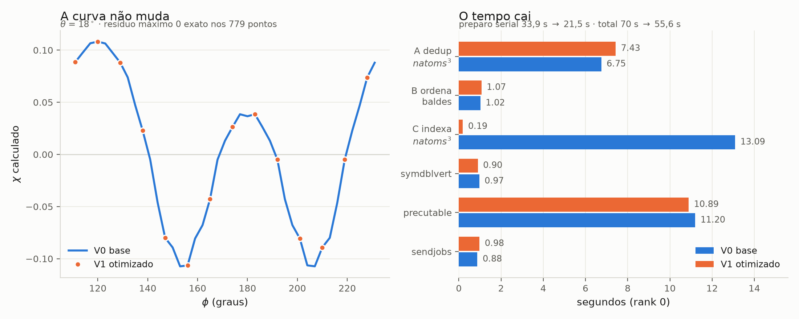

# Otimização do preparo serial do MSCD

Caderno da campanha de otimização do `symtrivert` ("Analyzing/Reanalyzing") e do
resto do preparo serial. Iniciado em 04/08/2026, cluster Ag(111) raio 9 /
profundidade 20, 247 átomos.

Linha de base, critério de validação e medições por fase: **`baseline/README.md`**.
Mapa das equações: `EQUACOES.md`. Arquitetura geral: `README.md`.

## A regra do jogo

**Toda versão tem de reproduzir as 787 linhas de intensidade byte a byte.**
`./baseline/regressao.sh` verifica. Nenhuma otimização aqui troca precisão por
velocidade — todas eliminam trabalho redundante ou trocam a estrutura de dados,
mantendo a mesma aritmética na mesma ordem.

Isso não é preciosismo: os laços a jusante percorrem `tevenpar` na ordem do
índice (`mscdrunc.cpp:166,358,462,486`, `mscdrund.cpp:605`) e acumulam em ponto
flutuante. **Reordenar `tevenpar` muda o resultado na última casa.** Por isso
toda versão preserva a ordem exata do original, mesmo quando a ordem em si é
arbitrária.

## O diagnóstico

`symtrivert` não é busca de simetria no sentido de teoria de grupos. É
**deduplicação**: reduzir os `natoms³` trios ordenados (emissor, espalhador₁,
espalhador₂) ao conjunto das assinaturas geométricas distintas
`(r₁, 1/r₂, cos β, espécie)` — 15 069 223 → 823 318 no cluster atual.

A tabela hash é feita à mão, com baldes de capacidade fixa, e tem três fases:

| fase | linhas | o que faz |
|---|---|---|
| **A** | 385-454 | varre `natoms³`, calcula a assinatura, procura no balde por **varredura linear**, insere se não achou |
| **B** | 457-511 | ordena cada balde por (cos β, 1/r₂, r₁) com *selection sort* O(n²) e compacta tudo num array contíguo |
| **C** | 534-575 | varre `natoms³` **de novo**, recalcula a mesma assinatura, e acha o índice final por busca linear no balde |

O "Reanalyzing" é o estouro de um balde: `nsymm/=2`, `ia=ib=ic=natoms+10`, e
**tudo recomeça do zero** (linha 449). No cluster atual acontece 1 vez, ou seja,
metade do trabalho da fase A é retrabalho.

Custo total ≈ `natoms³ × ocupação_do_balde`. Como o número de distintos cresce
mais rápido que `natoms²`, o total escala perto de `natoms³·⁸` — é por isso que
interfaces complicadas explodem.

## Medições

`-np 6`, build com `-DMSCDTIMER`. Tempo em regime, descartando a primeira rodada
(fria). Dispersão entre rodadas: 3% — **ganho abaixo de ~5% é ruído**.

| etapa (rank 0) | V0 base | V1 | V2 (previsto) |
|---|---:|---:|---:|
| `symtrivert` A — dedup `natoms³` | 6,75 s | 7,43 s | ~0,5 s |
| `symtrivert` B — ordena baldes | 1,02 s | 1,07 s | ~0,1 s |
| `symtrivert` C — indexa `natoms³` | 13,09 s | **0,19 s** | ~0,1 s |
| **`symtrivert` total** | **20,87 s** | **8,70 s** | ~0,7 s |
| `symdblvert` | 0,97 s | 0,90 s | 0,90 s |
| `precutable` | 11,20 s | 10,89 s | 10,89 s |
| `sendjobs` | 0,88 s | 0,98 s | 0,98 s |
| **preparo serial** | **33,9 s** | **21,5 s** | ~13 s |
| laço dos 779 pontos (paralelo) | 30,7 s | 30,7 s | 30,7 s |
| **total, em regime** | **70 ± 2 s** | **55,6 ± 1,2 s** | ~47 s |
| pico de RSS | 582 MB | 582 MB | |

V1 = 55,76 / 54,28 / 56,67 s. **Ganho de 20,6%**, bem acima dos 3% de ruído.
Curva idêntica byte a byte, e `nsymm=1525` / `ntrieven=823318` idênticos.

*(a coluna V2 é previsão; será substituída pelo medido)*



Figura gerada por `baseline/figura.py` a partir das duas curvas gravadas.
**Resíduo máximo entre V0 e V1: 0 exato**, nos 779 pontos — não é "concordância
dentro da tolerância", é o mesmo número em todos eles.

---

## V1 — fundir a fase C na fase A

**A observação.** As fases A e C percorrem os mesmos 15 milhões de trios e
calculam exatamente a mesma assinatura. A fase A **já descobre** em que slot do
balde cada trio cai — e joga a informação fora:

```c
if (...casou...) j=n+tempadd[m]+10;   // linha 408 do original: o slot é perdido
```

A fase C existe só para redescobrir esse índice, e custa o dobro da A (13,1 s
contra 6,8 s) porque busca em `tevenpar`, cujo passo é de 40 bytes (`[j*10+k]`)
e estoura a L1, enquanto o array da fase A tem passo de 12 bytes.

**A mudança.**

1. `tevenadd` (que já existe e já tem exatamente `natoms³` ints) passa a ser
   alocado **antes** da fase A, e a fase A grava nele o slot de cada trio.
2. Dois arrays novos de `nsymm*tscatter` ints: `origem[]` acompanha de onde veio
   cada entrada enquanto a fase B embaralha os baldes; `destino[]` traduz
   slot-da-fase-A → índice compactado final, preenchido durante a compactação.
3. A fase C vira `tevenadd[n] = destino[tevenadd[n]]` — uma passada de
   remapeamento, sem geometria e sem busca.

**Por que o resultado não muda.** A fase B só permuta entradas; `origem[]`
registra a permutação exata. O conjunto, a ordenação e a compactação continuam
idênticos, byte a byte. O erro 621 (assinatura não encontrada) passa a ser
disparado por `destino[slot] < 0`, que é a mesma condição.

**Custo em memória: nenhum, medido.** Eram esperados +100 MB (os 40 MB de
`origem`+`destino`, mais 60 MB porque `tevenadd` agora convive com `tempar` em
vez de ser alocado depois que ele morre). O pico de RSS não mudou: 582 MB nas
duas versões. O pico do processo é fixado em outro ponto do programa, não aqui.

**O que custou.** A fase A subiu de 6,75 s para 7,43 s (+10%): são 15 milhões de
escritas espalhadas num array de 60 MB, que a versão antiga não fazia. Paga-se
0,7 s na A para economizar 12,9 s na C.

**Resultado medido.** `symtrivert` 20,87 → 8,70 s. Total 70 → 55,6 s, **−20,6%**.
Curva idêntica byte a byte.

**Bug corrigido de brinde.** O original refazia `new tempadd`/`new tempar` a cada
Reanalyzing **sem liberar os anteriores** (linha 381): ~130 MB vazados por volta.
Agora libera antes de realocar.

---

## V2 — hash de verdade, e o fim do Reanalyzing (planejado)

Ataca A (6,75 s) e B (1,02 s) de uma vez. Depende do V1 estar fechado.

**A chave do problema.** O índice do balde `m` é **função pura da assinatura**
(linhas 401-404): assinaturas iguais caem sempre no mesmo balde, para qualquer
`nsymm`. Logo **o conjunto distinto não depende de `nsymm`**. Isso é o que
permite separar duas coisas que hoje estão amarradas: *descobrir quais são os
distintos* (caro, `natoms³`) e *escolher o `nsymm` e arrumar os baldes* (barato,
823 mil itens).

**O segundo fato que destrava.** Todas as três chaves são quantizadas antes de
comparar — `round(...,0.005f)` nas linhas 390/400/402 e `vlenc = kmin/100`. Chave
quantizada é inteiro exato, então dá para hashear com igualdade **idêntica** à
comparação de floats que o código faz hoje. O hash não é aproximação.

**O algoritmo.**

1. **Uma** passada sobre `natoms³` com hash de endereçamento aberto sobre
   `(lena, vlenb, cosbeta)` convertidos a inteiro. Sem capacidade fixa, logo sem
   estouro e **sem Reanalyzing**. Guarda o id da assinatura em `tevenadd` (como
   no V1). Custo por trio: ~1 sonda em vez de ~270 comparações.
2. **Descobrir o `nsymm` final** simulando a regra original sobre as 823 mil
   assinaturas distintas — não sobre os 15 milhões de trios:
   - começa em `nsymm = natoms²/20`;
   - `tscatter = mscatter/nsymm/3`;
   - conta quantos distintos caem em cada balde (recalcular `m` para 823 mil
     itens é barato);
   - se algum balde tem contagem `> tscatter`, então `nsymm/=2` (mais a regra de
     crescimento `if (nsymm<10 && mscatter<=5*natoms³) mscatter=mscatter*3/2`) e
     repete.

   Isso reproduz **exatamente** o `nsymm` a que o original converge. A
   equivalência vale porque o original dispara o estouro quando a contagem
   ultrapassa `tscatter` durante a inserção, e contagem final `> tscatter` ⟺
   ultrapassou em algum momento.
3. **Montar o layout** no `nsymm` final: ordenar cada balde por
   (cos β, 1/r₂, r₁) e concatenar na ordem `m = 1..nsymm-1`. Isso é exatamente o
   que as fases B produzem hoje — verificado relendo a compactação das linhas
   493-511, que emite as entradas na ordem ordenada. Trocar o *selection sort*
   O(n²) por `std::sort` com o mesmo comparador de 3 chaves.
4. **Remapear `tevenadd`**, como no V1.

**Onde isso pode dar errado, em ordem de risco.**

- A ordem final tem de bater com a do original. O ponto delicado é a
  compactação (linhas 493-511), que parece emitir na ordem ordenada mas tem o
  teste `tempar[p*3]==0.0` fazendo dupla função de "entrada consumida" e
  "comprimento zero". Conferir com um dump comparativo de `tevenpar` antes de
  confiar.
- Empates: dentro de um balde as três chaves juntas são únicas (a dedup
  garante), então `std::sort` não precisa ser estável.
- Se `nsymm` simulado não bater com o do original, o layout muda e a curva muda.
  Instrumentar e comparar `nsymm` e `ntrieven` antes de comparar a curva.

---

## Depois do V2

Nesta ordem, pelo que as medições mostram:

1. **`precutable` (11,2 s)** vira o maior item serial. Precisa da mesma
   instrumentação interna que o `symtrivert` levou — ainda não foi feito.
2. **Paralelizar o que sobrar.** As três fases são paralelizáveis: A por `ia`
   com hash local por thread e união no fim; B por balde (independentes), com
   prefix-sum para a compactação; C é perfeitamente paralela (cada trio escreve
   um elemento distinto de `tevenadd`), bastando resolver o "representante"
   `tevenpar[j*10+4,7,8,9]` pelo menor `(ia,ib,ic)`, que é o que a ordem serial
   já produz. **OpenMP, não MPI**: tudo já está no espaço do rank 0.
3. **GPU.** A fase A é 15 milhões de cálculos de assinatura independentes mais
   sondas de hash — caso de livro-texto. Fazer só depois de 1 e 2: o ganho
   algorítmico é maior que o de hardware, e é o mesmo trabalho necessário para
   portar.

Medido e descartado: `--mca mpi_yield_when_idle 1` **não** ajuda (69,87 s contra
70,42 s, dentro do ruído). Com `-np 6` numa máquina de 6 núcleos físicos / 12
threads os ranks ociosos cabem nos hyperthreads e não roubam do rank 0. A
observação do `README.md` sobre ranks ociosos vale para `-np 10`.

## Limite de escala achado no caminho

`tevenadd` é indexado por `ia*natoms*natoms+ib*natoms+ic` em `int`. Acima de
**natoms ≈ 1290** isso estoura o int de 32 bits e corrompe silenciosamente. É
pré-existente, não foi introduzido aqui, e ainda não foi corrigido.
