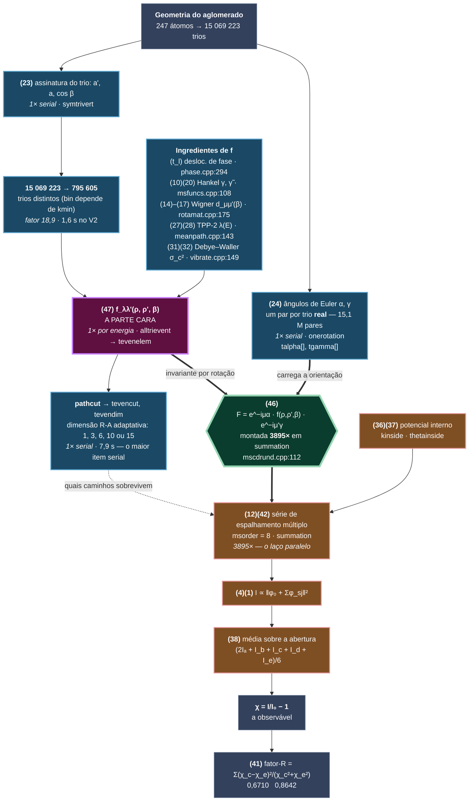

# MSCD_ATA_GPU

Ponto de partida: **MSCD 1.37** (Yufeng Chen e Michel A. Van Hove, LBNL, 1997–98),
cálculo de difração e dicroísmo de fotoelétrons (XPD/PED) por espalhamento
múltiplo. C++98, 69 arquivos, ~19 mil linhas, paralelizado com MPI.

A tag `v0` é o código **como recebido**, compilando e rodando em g++ 13 /
Open MPI 4.1.6. O `main` está em **V4**, com três otimizações aplicadas e
**curva idêntica byte a byte ao V0** em todas elas:

| | onde | o que mudou | ganho |
|---|---|---|---|
| **V1/V2** | `mscdrunb_not_reanalize.cpp` | `symtrivert`: fase C redundante eliminada, hash no lugar da busca linear, `std::sort` no lugar dos *selection sorts* | 20,87 → 1,59 s na fase |
| **V3** | `precutable` | inverter os laços do `pathcut` | **piorou 13%, revertida** |
| **V4** | `mscdrund.cpp:128` | o teste do `tevencut` movido para **antes** de encher o `csum` — 99,87% dos pares saem no `continue`, então encher antes era ler 15 complexos para jogar fora | laço de `m` 48,1 → 27,6 s |

**Nenhum paralelismo novo foi introduzido.** O número de ranks e a divisão das
779 direções continuam exatamente como estavam; o que mudou foi trabalho
eliminado dentro de cada rank. O nome **V3 está queimado** (foi o resultado
negativo): a próxima otimização é V5.

**Medições versão por versão e o que mudou em cada uma:
[`OTIMIZACAO.md`](OTIMIZACAO.md)** — comece pela seção "COMO CONTINUAR".
Critério de validação e linha de base congelada:
[`baseline/README.md`](baseline/README.md). Mapa das ~40 equações do manual para
arquivo:linha: [`EQUACOES.md`](EQUACOES.md).

> ### ⚠ A configuração de física mudou em 04/08/2026, e ela invalida números antigos
>
> O `ps01` era `psAg111-slab.txt`, que só cobre k 16,00–18,00. O `kconfine`
> (`phase.cpp:419`) levantava **em silêncio** o k pedido de 13,63 para 16,00 —
> o cálculo rodava a 975 eV contra dado experimental medido a 708 eV. Agora o
> `ps01` é **`psAg111.txt`** (mesma prata, k 5,00–17,75, `lnum=20`), e o log
> confirma `13.63 13.63`. A configuração anterior está em `Cov0.txt.k16-slab.bak`.
>
> Isso mexe em mais coisa do que parece. Os fatores-R mudaram (0,6724 0,8647 →
> **0,6710 0,8642**) porque o deslocamento de fase mudou, e a **contagem de trios
> distintos também** — `mscdrunb_not_reanalize.cpp:411` faz `vlenc = kmin/100.0f`,
> ou seja, o `kmin` entra direto na largura do bin de deduplicação do
> `symtrivert`. A dedup não é puramente geométrica.
>
> **Nenhum número medido antes de 04/08/2026 20:47 é comparável com os de
> depois.** Derivação completa na seção "O k errado" do `OTIMIZACAO.md`.

## Compilar e rodar

```bash
make randmscd_parallel CPPFLAGS="-O3 -std=c++98 -w -fpermissive"
mpirun --use-hwthread-cpus -np 4 randmscd_parallel Cov0.txt
```

Resultado correto: `factors = 0.6710 0.8642`, curva em
`saida1Co-alterado-alexandre.txt`. **Os `factors` não servem de teste de
regressão**: mudaram só de 0,6724 0,8647 para 0,6710 0,8642 quando 783 das 787
linhas de intensidade mudaram, porque são fatores de escala do ajuste. O teste é
o `baseline/regressao.sh`, que compara as 787 linhas byte a byte.

**Use `-np ≥ 4`, e evite `-np 6`.** O `np` ótimo **não é estável** entre janelas
de medição — ver "Medições". O que é estável: `np=6` é consistentemente o pior
de {4, 6, 8, 12}.

As duas flags não são preferência:

- **`-fpermissive`** — `fcomplex.h:46` declara
  `friend Fcomplex polar(float,float=0)`. Argumento padrão em `friend` que não é
  definição: ilegal no padrão, aceito pelos compiladores de 1998, recusado pelo
  g++ 13. É o único erro em 69 arquivos.
- **`--use-hwthread-cpus`** — o Open MPI conta núcleos *físicos* (6 num
  i5-13420H), não threads (12), e desde a série 3.x recusa superalocar em vez de
  aceitar calado como a 1.10 fazia. Sem ela, `-np 10` morre em
  "not enough slots".

O `makefile` constrói outros doze executáveis; só o `randmscd_parallel` interessa.

## Não é o MSCD 1.37 de fábrica: tem ATA

Este código carrega uma extensão **ATA** (*average t-matrix approximation*) que
não existe no MSCD original, para tratar ligas superficiais aleatórias
substituindo os espalhadores por uma matriz-t efetiva

    t = (1 − w)·t₁ + w·t₂

`Mscdrun::ATAevenelem` (`mscdrunc.cpp:46`) implementa a mistura, e ela entra em
`alltrievent` (`mscdrunc.cpp:135`) e `alldblevent` (`mscdrunc.cpp:753`), na
montagem dos elementos de espalhamento.

> **Correção de 05/08/2026.** Aqui dizia que essa montagem "é parte da fase
> **serial**, não do laço por direção". **É falso.** O `alldblevent` é chamado de
> `mscdrund.cpp:293`, **dentro** do laço dos 779 pontos (uma vez por direção,
> quando `k==0`), e o perfil mostrou que ele é **57% do laço** — o maior item
> isolado do programa. Se o ATA for ligado um dia, o custo dele cai inteiro sobre
> a parte paralela, não sobre o preparo.

A referência é Soares, de Siervo, Landers e Kleiman,
*Photoelectron diffraction from random surface alloys: critique of calculational
methods*, Surface Science **497** (2002) 205–213.

Liga-se pela linha do arquivo de entrada:

```
0       0.7     0.2     ATA, ATAWeight1, ATAWeight2
```

No `Cov0.txt` desta linha de base o ATA está **desligado** (`ATA=0`), de modo que
os números medidos abaixo são do caminho de cálculo comum.

## A fatoração que organiza o programa inteiro

> O **`EQUACOES.md`** mapeia as ~40 equações do manual (`MANUAL_MSCD_CEA.pdf`)
> para arquivo e linha, nos dois sentidos. Comece por lá antes de abrir qualquer
> `.cpp`: o código chama as coisas de `cxa`, `algam` e `tevenelem`; o manual
> chama de Γ, F e t_l, e nada nos dois liga um ao outro.

Há uma única ideia no centro do MSCD, e ela está na eq. (46) do manual (pág. 36).
A matriz de amplitude de espalhamento — o objeto que aparece uma vez para cada
trio (emissor, espalhador, receptor) em cada caminho de cada ordem — **se
fatora**:

$$F_{\lambda\lambda'}(\boldsymbol{\rho},\boldsymbol{\rho}') \;=\; \underbrace{e^{-i\mu\alpha}}_{\text{barato}} \;\cdot\; \underbrace{f_{\lambda\lambda'}(\rho,\rho',\beta)}_{\text{caro}} \;\cdot\; \underbrace{e^{-i\mu'\gamma}}_{\text{barato}}$$

com

$$f_{\lambda\lambda'}(\rho,\rho',\beta) \;=\; e^{-\frac{a'}{2\lambda} - k^2(1-\cos\beta)\sigma_c^2} \;\frac{e^{i\rho'}}{\rho'}\; \sum_l t_l \, \gamma^l_{\mu\alpha}(\rho) \, d^l_{\mu\mu'}(\beta) \, \tilde\gamma^l_{\mu'\nu'}(\rho')$$

O que distingue os dois lados **não é o tamanho da conta, é de que a conta
depende**:

| | depende de | quantos objetos distintos |
|---|---|---|
| **caro** — `f` | só dos dois comprimentos de ligação e do ângulo β entre eles | **795 605** |
| **barato** — as fases | dos ângulos de Euler α e γ, isto é, da **orientação absoluta** do par no espaço | 15 069 223 |

Gire um trio de átomos rigidamente no espaço: `f` não muda, só as fases mudam.
Como `f` carrega a soma sobre momento angular, as matrizes de Wigner, os
deslocamentos de fase `t_l`, o livre caminho médio e o Debye–Waller, e as fases
são uma exponencial de tabela — a assimetria de custo é enorme.

Daí sai **tudo**:

- **Por que existe uma fase serial gorda.** Alguém precisa varrer os 247³ = 15,07
  milhões de trios, reduzi-los às 795 605 assinaturas distintas e calcular `f`
  uma vez para cada. É o `symtrivert` + `precutable` + `alltrievent` — os ~11,4 s
  que não escalam com `-np`.
- **Por que ela é difundida, e não recalculada.** O resultado é uma tabela grande
  — só as quatro arrays `natoms³` já dão **241 MB** (ver "Quanto isso ocupa").
  Cada rank recebe uma cópia inteira via `sendjobs`.
- **Por que o laço paralelo é barato por ponto.** Ele só aplica as fases e soma.
- **Por que o fator de economia é 18,9**, e não mais: é 15 069 223 / 795 605.

### O grafo das equações

Cada nó é uma equação do manual; a cor diz **quantas vezes ela roda**. A eq. (46)
é a fronteira: tudo à esquerda dela é pago uma vez, tudo à direita é pago 3895
vezes.



**Azul** = pago uma vez, serial, só no rank 0 — os ~11,4 s que não escalam.
**Roxo** = a parte cara, uma vez por energia. **Verde** = a fatoração.
**Laranja** = pago 3895 vezes, o laço paralelo.

Repare que **os dois lados da eq. (46) são pré-calculados na fase serial**: `f`
uma vez por assinatura distinta, os ângulos α e γ uma vez por trio real. O que
se repete 3895 vezes é só *montar* o produto e somar a série. Tudo que dava para
pré-calcular já foi pré-calculado em 1997 — é por isso que o laço quente é
limitado por banda de memória e não por aritmética, como as medições mostram.

O `EQUACOES.md` destrincha cada nó: a equação, o arquivo e a linha.

### Quanto isso ocupa

Por rank, derivado das alocações (`mscdrun.cpp:104-152`) com `natoms=247`
(`natoms³ = 15 069 223`), `radim=15`, `msorder=8`, `ntrieven=795 605`:

| array | tipo e tamanho | bytes |
|---|---|---:|
| `tevenadd` | `int[natoms³]` — índice do trio distinto | 60,3 MB |
| `tevendim` | `int[natoms³]` — dimensão R-A empacotada, 4 bits por ordem | 60,3 MB |
| `talpha` | `float[natoms³]` — ângulo de Euler α | 60,3 MB |
| `tgamma` | `float[natoms³]` — ângulo de Euler γ | 60,3 MB |
| `tevenpar` | `float[ntrieven*10]` | 31,8 MB |
| `devendetec` | `Fcomplex[natoms²*radim]` | 7,3 MB |
| `tevencut` | `int[msorder*natoms²]` | 2,0 MB |
| `tevenelem` | `Fcomplex[ntrielem]`, `ntrielem = Σ eledim²` | o resto |

**Não confie na linha "This job allocated … megabytes" do `mscdlist.txt`.** O
`getmemory()` (`mscdruna.cpp:33`) conta **uma** das duas arrays `int[natoms³]` e
**uma** das duas `float[natoms³]` — subestima em ~120 MB — e a impressão
(`mscdrunc.cpp:573`) ainda multiplica por `numpe*2`. É uma estimativa de 1997,
não uma medição.

**Medido** (`/usr/bin/time -f %M`, 05/08/2026): **313 MB com `np=1`, 581 MB com
`np>1`.** A diferença é o `sendjobs`, que serializa o job inteiro num buffer
antes de enviar — o rank 0 chega a segurar duas cópias. Os 313 MB batem com a
soma das alocações acima: as arrays `natoms³` já são 241 MB, e sobra pouco para o
`tevenelem`, o que é coerente com a dominância de `evedim=1` no histograma.
*(O valor de 582 MB que circulava nas versões antigas deste arquivo era isto —
uma medição de `np>1` lida como se fosse o tamanho das tabelas.)*

### O que isso diz para a GPU

A fronteira do grafo é a fronteira do trabalho. Do lado direito estão os 3895
solves independentes — é o que vale portar. Mas repare que o lado esquerdo
**não** é preparação trivial: são ~11,4 s de `natoms³` com deduplicação por hash
e uma varredura de esparsidade, hoje inteiramente sequenciais. Com o laço a zero,
o programa ainda levaria esses ~11,4 s.

A eq. (46) impõe uma restrição concreta ao formato dos dados: `tevenelem` (o lado
caro) é indexado por **assinatura geométrica**, enquanto `talpha`/`tgamma` (o lado
barato) são indexados por **trio real**. São dois espaços de índice diferentes,
ligados pela indireção `tevenadd[ia][ib][ic]`.

> **Correção de 05/08/2026.** Este parágrafo terminava afirmando que essa
> indireção era o que dominava o tempo. **É falso, e a medição mostrou.** O laço
> que percorre a indireção é 22% do total e quase não executa: 99,87% dos trios
> são podados antes de chegar lá. O que domina é o `alldblevent`, com 57% — e ele
> não toca em `tevenadd`. A frase era plausível lendo o código e sobreviveu duas
> revisões deste arquivo sem ninguém medir. Ver "Onde o tempo vai por dentro".

## O que o programa calcula

Entrada `Cov0.txt`: Ag(111) fcc, raio 9 Å / profundidade 20, `nlayer=9` ⇒
**`natoms=247`** átomos no aglomerado, `msorder=8` (ordem máxima de espalhamento
múltiplo), `raorder=4` (⇒ `radim=15`, dimensão da expansão separável de
Rehr–Albers), `linitial=1`, rede 4,086 Å, `ATA=0` (desligado).

O `lnum` do `Cov0.txt` é **0**, que não significa "nenhum" e sim "sem teto": o
valor efetivo vem do arquivo de deslocamento de fase, e `psAg111.txt` declara
`lnum=20` na linha 12. `phase.cpp:185` (`if ((alnum>0)&&(lnum>alnum)) lnum=alnum`)
só usaria o do `Cov0.txt` para limitar. Portanto **`lnum=20` de fato**.

A varredura é angular a módulo de k fixo, `kmin=kmax=13,63 Å⁻¹`:

```
dtheta 18…72 passo 3  →  19 valores
dphi  111…231 passo 3 →  41 valores
                         19 × 41 = 779 = npoint
```

Para cada uma das 779 direções de emissão (θ,φ) o código resolve a série de
espalhamento múltiplo e devolve a intensidade e a modulação
χ = I/I₀ − 1.

## Onde está o paralelo — e onde não está

**O paralelismo é sobre as 779 direções de emissão, e só sobre elas.**

O modelo é mestre–trabalhador com difusão do job (não divisão de domínio). A
fatia de cada rank sai de uma divisão estática em `Mscdrun::assistant`:

```cpp
// mscdrun.cpp:808
k = npoint/numpe;  m = npoint%numpe;
if (mype<m) { pdbeg=(k+1)*mype;          pdend=pdbeg+k+1; }
else        { pdbeg=(k+1)*m+k*(mype-m);  pdend=pdbeg+k;   }
```

e é consumida no único laço paralelo do programa:

```cpp
// mscdrund.cpp:221  —  Mscdrun::intensity
for (i=pdbeg; (error==0)&&(i<pdend); ++i)
{ ...
  for (k=0; k<5; ++k)                       // cone de aceitação, accepang=1.5°
  { thetainside(...);
    if (k==0) error=alldblevent(akin,xdetec);
    error=allevendetec(akin,xdetec);        // propagador do lado do detector
    error=summation(akin,xdetec,polaron,    // <-- a conta pesada
                    &suminten,&bakinten,asum,bsum,csum);
  }
}
```

São **779 × 5 = 3895 resoluções independentes** da série de espalhamento
múltiplo (5 sub-direções por ponto, para a média sobre o cone de aceitação de
1,5° do analisador; a central entra com peso dobrado).

`Mscdrun::summation` (`mscdrund.cpp:21`) é o núcleo: parte das amplitudes de
um espalhamento e itera a série

```cpp
for (m=msorder; m>=2; --m)      // 7 passadas para msorder=8
  for (ia<natoms) for (ib<natoms) for (ic<natoms)
    for (j<radim) for (k<radim)
      csum[j] += algam[t] * bsum[ib][ic][k] * tevenelem[mevadd + j*eegdim + k];
```

ou seja, sete produtos matriz-vetor esparsos sobre o espaço de caminhos
(emissor, espalhador₁, espalhador₂), com matrizes 15×15 por trio e
`algam = exp(i(−pγ − qα))` girando entre os referenciais locais. No fim, para
cada emissor e cada `m` de −l a +l, soma a onda espalhada com a onda direta e
eleva ao quadrado.

### O que **não** é paralelo

Todo o preparo geométrico está dentro de um `if (mype==0)` — literalmente:

```cpp
// mscdjob.cpp:397
if (mype==0)
{ mscdrun->init();
  error=mscdrun->readparameter();
  error=mscdrun->paradisp();
  error=mscdrun->symtrivert();    // <-- "Analyzing / Reanalyzing"
  error=mscdrun->symdblvert();
  error=mscdrun->precutable();
}
if ((error==0)&&(numpe>1)&&(mype==0)) error=mscdrun->sendjobs();
else if (numpe>1)                     error=mscdrun->receivejobs();
```

Enquanto isso os outros ranks estão parados dentro de `receivejobs()`. **Não é
que essa parte escale mal: ela não é paralela de forma alguma.** Aumentar `-np`
não pode ajudá-la nem em princípio.

O que cada etapa serial faz:

| etapa | o que calcula |
|---|---|
| `symtrivert` (`mscdrunb_not_reanalize.cpp:386`) | varre os `natoms³` = 15,07 milhões de trios de átomos, reduz cada um à assinatura (r₁, 1/r₂, cos β), deduplica e produz **795 605 trios distintos** (`ntrieven` no `mscdlist.txt`), em `nsymm=1525` baldes. A assinatura **não é puramente geométrica**: a largura do bin é `vlenc=kmin/100.0f` (linha 411), então mudar o k muda a contagem. "Reanalyzing" é o recomeço do zero quando um balde estoura: `nsymm/=2` e volta ao início. Nesta entrada o log marca `Analyzed symmetries for 2 times`, isto é, 1 recomeço. |
| `symdblvert` | o mesmo para pares: **40 562** duplas distintas (`ndbleven`) |
| `precutable` (`mscdrunc.cpp:286`) | coeficientes vibracionais, matrizes de rotação, expansão esférica (Hankel), `alltrievent(1,kmin)` para os elementos de matriz de espalhamento, e a varredura `msorder × natoms³` que monta as máscaras de esparsidade `tevencut`/`tevendim` do `pathcut` |
| `sendjobs` (`mscdrun.cpp:502`) | serializa o job inteiro (**centenas de MB**) e o envia **num laço sequencial de `mpisend` ponto a ponto**, rank por rank — não há `MPI_Bcast`. Custo ∝ `numpe`: 0,97 s com 6 ranks, ~10 s projetados com 64. É o defeito que mais atrapalha em máquina grande. |

## Medições

i5-13420H (6 núcleos físicos / 12 threads), Open MPI 4.1.6, g++ 13,
`-O3 -std=c++98`, configuração corrigida de k = 13,63. Tabela pelo **mínimo** das
repetições. Dados brutos em `baseline/escala.csv`, figura em
`baseline/escalabilidade.png`.

**Duas janelas de medição.** V0 vem da campanha de 04/08/2026 20:47
(`baseline/campanha.sh`); V2 e V4 foram medidos juntos em 05/08/2026
(`baseline/campanha-v4.sh`), em build de produção sem `-DMSCDTIMER`. O V2 foi
remedido de propósito, para que a razão V4/V2 não cruzasse janelas. **A deriva do
V2 entre as duas foi +0,8% em média, +6,5% no pior `np`** — pequena, mas a coluna
"V4 sobre V0" carrega essa margem.

**`factors = 0.6710 0.8642` em todas as rodadas**, nas três versões e em todos os
`np`: o resultado não depende nem da versão nem do número de ranks.

| `-np` | V0 (04/08) | V2 (05/08) | V4 (05/08) | V4 sobre V0 |
|------:|---------:|---------:|---------:|---:|
| 1  | 146,49 s | 144,52 s | 132,45 s | 1,11× |
| 2  |  87,53 s |  77,49 s |  71,45 s | 1,23× |
| 4  |  64,26 s |  51,07 s |  45,93 s | 1,40× |
| 6  |  70,97 s |  53,29 s |  46,08 s | 1,54× |
| 8  |  69,06 s |  49,30 s |  44,67 s | 1,55× |
| 12 |  69,70 s |  47,92 s | **44,05 s** | **1,58×** |


### Onde o tempo vai por dentro

Dois níveis de cronômetro, ambos sob `#ifdef MSCDTIMER`. **Preparo serial**
(rank 0, `np=1`, máquina leve):

| fase | tempo |
|---|---:|
| **`symtrivert` total** | **1,37 s** |
| `symdblvert` | 0,83 s |
| `precutable` — dos quais **7,9 s no `pathcut`** | ~9,2 s |
| **preparo serial** | **~11,4 s** |

*A carga da máquina quase dobra isso: os mesmos números com o navegador aberto
deram 2,72 s e 16,34 s. Não meça com a máquina ocupada.*

**Dentro do laço dos 779 pontos** (`np=1`, V4). Aqui os cronômetros são
acumuladores, não impressões por chamada — `summation` roda 3895 vezes e um
`fprintf` por chamada custaria mais que a região medida:

| bloco | tempo | % do laço |
|---|---:|---:|
| **`alldblevent`** (`mscdrunc.cpp:753`) | **71,14 s** | **57,0%** |
| `summation` — laço de `m` | 27,60 s | 22,1% |
| `summation` — bloco final (`onevenemit`) | 11,22 s | 9,0% |
| `allevendetec` | 10,95 s | 8,8% |
| `summation` — init do `asum` | 3,89 s | 3,1% |

Os acumuladores fecham em 99,7% com o cronômetro do laço inteiro.

**O `alldblevent` serve de controle para medir o V4.** Ele não foi tocado pela
mudança, então a variação dele entre as duas rodadas é a variação da máquina:

| bloco | V2 | V4 | |
|---|---:|---:|---|
| `alldblevent` (**controle, código intocado**) | 73,58 s | 71,14 s | −3,3% |
| **laço de `m`** | 48,10 s | **27,60 s** | **−42,6%** |
| bloco final (`onevenemit`) | 12,25 s | 11,22 s | −8,4% |
| `allevendetec` | 10,07 s | 10,95 s | +8,7% |
| init do `asum` | 4,26 s | 3,89 s | −8,7% |
| **soma do laço** | **148,26 s** | **124,80 s** | **−15,8%** |

A máquina variou 3,3%; o laço de `m` caiu 43%. **Esse é o jeito de medir um
ganho sem máquina dedicada** — não confie no tempo de parede quando há um bloco
intocado disponível para normalizar.

### Por que o laço de `m` custava tanto sem calcular quase nada

Histograma do `evedim`, medido uma vez (as máscaras do `pathcut` não mudam entre
direções, porque `kmin=kmax` e a energia é constante na corrida inteira):

```
visitas potenciais (m,ia,ib,ic)     90 231 570
  podados por tevencut (par ia,ib)  90 110 787   99,87%
  podados por evedim<1 ou ic==ib       119 328    0,13%
  evedim= 1    762 trios        762 MACs
  evedim= 3    625 trios      5 625 MACs
  evedim= 6     17 trios        612 MACs
  evedim=10     30 trios      3 000 MACs
  evedim=15     21 trios      4 725 MACs
```

**Sobrevivem 1 455 trios, 14 724 multiplicações no total** — trabalho de
microssegundos. Os 48 s eram **tráfego de memória**: a cópia `bsum ← asum` e o
preenchimento do `csum`, 51 MB cada por chamada de `summation`, × 3895 chamadas
≈ **400 GB para produzir 14 724 MACs**. A 8,3 GB/s isso dá exatamente os 48 s.
O V4 eliminou metade disso; a outra metade (a cópia `bsum ← asum`) segue lá.

Para reconstruir o binário instrumentado:

```bash
rm -f *.o && make randmscd_parallel \
  CPPFLAGS="-O3 -std=c++98 -w -fpermissive -DMSCDTIMER"
```

**Com** `-DMSCDTIMER` o `summation` faz um passe extra de histograma na primeira
chamada (~1 s): não use build instrumentado para medir tempo total.

Os cronômetros (`mscdtimer.h`) escrevem em **stderr** de propósito — stdout e o
`flogout` entram na comparação de regressão. Sem a macro não sobra instrução
nenhuma no binário. As fases seriais só imprimem no rank 0 (estão dentro do
`if (mype==0)` de `mscdjob.cpp:399-424`); os trabalhadores imprimem apenas
`sendjobs/receivejobs` — que para eles é a espera ociosa — e o laço.

Os próprios cronômetros mostram a ociosidade dos trabalhadores sem precisar de
mais nada. Num `-np 4` com o preparo serial em 20,3 s, os três trabalhadores
imprimem `sendjobs/receivejobs` de 20,0 / 20,3 / 20,5 s — exatamente o preparo
que atravessam parados — enquanto o rank 0 imprime 0,96 s no mesmo marcador.

O programa concorda por outro caminho. Com `dispmode` no dígito 5 ele emite em
`mscdlist.txt` a distribuição de tempo por processador. *(O bloco abaixo é
`-np 6` na configuração antiga de k = 16; os valores absolutos não valem mais, o
formato e a leitura qualitativa sim.)*

```
 pid computation   sending  receiving      idle comput send receiv  idle
   0  4.200e+01  1.000e+00  0.000e+00  0.000e+00  97.7   2.3   0.0   0.0
   1  2.500e+01  1.000e+00  0.000e+00  1.700e+01  58.1   2.3   0.0  39.5
   2  2.500e+01  1.000e+00  0.000e+00  1.700e+01  58.1   2.3   0.0  39.5
   3  2.400e+01  1.000e+00  1.000e+00  1.700e+01  55.8   2.3   2.3  39.5
   4  2.500e+01  0.000e+00  1.000e+00  1.700e+01  58.1   0.0   2.3  39.5
   5  2.500e+01  0.000e+00  1.000e+00  1.700e+01  58.1   0.0   2.3  39.5
 sum  1.660e+02  4.000e+00  3.000e+00  8.500e+01  64.3   1.6   1.2  32.9
```

O rank 0 nunca fica ocioso; cada trabalhador fica **17 s parado** — exatamente
o preparo serial que ele atravessa sem ter o que fazer. Um terço de todo o
tempo-processador da máquina vai embora esperando.

Quatro coisas saem daí:

1. **Sobre o `np` ótimo, a resposta honesta é "≥ 4, e evite 6".** A campanha de
   04/08 concluiu com confiança que o ótimo era `np=4`, porque ele ganhava do
   `np=6` nos quatro pareamentos independentes. Na campanha de 05/08 a ordem é
   `12 < 8 < 4 < 6` — e o `np=12` ganha do `np=4` nos quatro pareamentos, com o
   mesmo argumento apontando para o outro lado. A diferença entre eles (~6%) é do
   tamanho da deriva entre janelas. **O que sobrevive às duas medições:** `np=1`
   e `np=2` são claramente piores, e **`np=6` é consistentemente o pior de
   {4, 6, 8, 12}** (V2 deu 53,28 s e 53,29 s nas duas janelas) — curiosamente,
   justo o número de núcleos físicos. O teste de pareamento detecta ordenação
   *dentro* de uma janela, não a estabilidade dela entre janelas.
2. **Por que mais ranks ajudam menos do que deviam.** Os trabalhadores **queimam
   um núcleo cada um sem fazer nada** durante todo o preparo serial, girando na
   espera ocupada do `MPI_Recv` do Open MPI — ainda não receberam o job. Em 6
   núcleos físicos isso rouba o rank 0, que é justamente quem está trabalhando.
   Testado e sem efeito: `--mca mpi_yield_when_idle 1` e `--oversubscribe` (pior).
3. **O ganho das otimizações cresce com o `np`**: o V4 sai de 1,11× sobre o V0 em
   `np=1` para 1,58× em `np=12`. Quanto mais o laço paralelo encolhe, mais o
   preparo serial domina — e é ele que o V1/V2 cortaram. **Otimizar o serial é o
   que permite usar máquina grande.**
4. **O gargalo não é mais o preparo serial.** Ele é ~11,4 s de 132,45 s em
   `np=1`, ou seja **8,6%** ⇒ teto de Amdahl **11,6×**; o medido é 3,0×. A
   diferença está toda dentro do laço, e desde 05/08 ela tem nome: **o
   `alldblevent` sozinho é 57% dele.**

## O que isso significa para o port de GPU

> Esta seção foi **reescrita em 05/08/2026**. A versão anterior apontava o laço
> de `m` do `summation` como alvo, por leitura do código. O perfil mostrou que
> ele é 22% do laço e quase não calcula física. Serve de aviso: **neste programa,
> ler o código não prevê onde o tempo está.**

**O alvo é o `alldblevent` / `evenelem`, 57% do laço.** `mscdrunc.cpp:753` varre
os 40 562 pares distintos e para cada um chama `evenelem` (`mscdrunc.cpp:22`) até
15 vezes; `evenelem` é a soma sobre `l`:

```cpp
for (al=0;al<alnum;++al)
{ xa=evenmat->rotharma(al,kelem,kharm,beta);
  cxb=phaseshift[akind-1].fsinexpa(akin,al);
  cxc=hankb->fhankelfaca(al,kb,vkb);
  cxd=hanka->fhankelfaca(al,ka,vka);
  cxa+=xa*cxb*cxc*cxd;
}
```

Para GPU é o caso confortável: **40 562 tarefas independentes**, sem comunicação,
aritmética densa, escrita coalescida em `devenelem[j*radim+…]`, e as tabelas
consultadas (deslocamento de fase, Hankel, harmônicos de rotação) são pequenas —
cabem em memória constante. E `alnum` dobrou (10 → 20) com a correção do k, o que
aumentou o peso deste bloco e é a mecânica por trás dos 116 → 135,65 s
registrados na época sem explicação.

O que as medições impõem:

- **O laço de `m` não é alvo de GPU.** Dos 90,2 milhões de visitas potenciais
  `(m,ia,ib,ic)`, **99,87% são podadas pelo `tevencut`**; sobram 1 455 trios com
  14 724 MACs no total. O custo dele é **tráfego de memória** — as cópias
  `bsum ← asum` e o preenchimento do `csum` — não conta. Metade disso o V4 já
  eliminou no CPU; a outra metade também é atacável no CPU, sem GPU nenhuma. E a
  divergência de `evedim`, que eu tinha apontado como o problema da GPU, **não
  existe**: não há trabalho para divergir.
- **A geometria é constante na corrida toda.** Como `kmin=kmax=13,63`, a energia
  nunca muda: `alltrievent` só é rechamado quando ela muda. As tabelas sobem para
  a GPU **uma vez** e ficam. ~313 MB, ~25 ms em PCIe 4 — irrelevante contra 125 s.
- **`Fcomplex` já é compatível.** `{float re, im}` (`fcomplex.h:31`), mesmo layout
  de `float2`/`cuFloatComplex`. Mas o `friend` com argumento padrão de
  `fcomplex.h:46` — o mesmo que exige `-fpermissive` — vai barrar o front-end de
  device: conte com escrever um tipo complexo próprio.
- **A validação byte a byte não sobrevive.** A redução soma em outra ordem e em
  `float` isso mexe no último bit. O critério terá de virar tolerância relativa,
  **decidida antes de escrever kernel**. Ver `baseline/README.md`.
- **Amdahl.** Preparo serial ~11,4 s de 132,45 s (`np=1`) ⇒ **teto de 11,6×** se
  só o laço for para a GPU. Para passar disso é preciso levar também o `pathcut`
  (7,9 s dos 11,4 s).

## Armadilhas do código

- **Se o programa girar a 100% de CPU sem escrever nada, é `phase.cpp`, não
  contenção.** `phase.cpp:312-313` deixa `i=0` passar — o guarda `if (i<0) i=0`
  é código morto, devia ser `if (i<1) i=1` — e a linha 316 então lê
  `phasea[-60]`, fora do array. Como `phasea` é `float*`, o que vem é lixo do
  heap; lixo grande faz o `while (xc-xb>90.0) xc-=180.0f` da linha 320 nunca
  terminar, porque um `float` grande absorve a subtração de 180. Provado no
  *disassembly* em 04/08/2026 (`rip = makephase+0x110`) depois de 52 min travado
  com a máquina vazia. **É intermitente** — depende do que estiver na memória
  antes do bloco. Hoje está **sem gatilho** (a tabela do `psAg111.txt` cobre o k
  de trabalho) e **não corrigido**. Para amostrar a pilha é preciso `sudo`, já
  que `ptrace_scope=1` só permite descendente:
  `sudo gdb -p PID -batch -ex "bt 25" -ex "info registers rip"`.
- **O `makefile` linka `mscdrunb_not_reanalize.o`, não `mscdrunb.o`.** O binário
  em uso é a variante modificada pelo Abner, que afrouxou a tolerância de
  deduplicação geométrica de 0,001 para 0,005 Å (e o limiar `natoms>100` para
  `>333`). `diff mscdrunb.cpp mscdrunb_not_reanalize.cpp` mostra tudo. Editar
  `mscdrunb.cpp` não tem efeito nenhum no executável.
- **`usercomp.cpp` e `usert3e.cpp` são cópias byte a byte do `userCluster.cpp`.**
  Os nomes sugerem variantes de plataforma; não são. Toda chamada MPI do código
  de física passa por essa camada fina (`mpisend`, `mpireceive`, `mpigetmype`…),
  e foi ela que permitiu trocar de versão de MPI sem tocar em cálculo nenhum.
- **`pgrep -x randmscd_parallel` dá 0 com o programa rodando** — o kernel trunca
  `/proc/PID/comm` em 15 caracteres e o nome tem 18. Use `pgrep -f`.
- **Sem alvo `clean` no `makefile`.** Para recompilar de verdade, tire os `.o`
  do caminho à mão.
- **O `dispmode` do arquivo de entrada é um número de dois dígitos.** As dezenas
  ligam o log em `mscdlist.txt` (`displog=dispjob/10`), as unidades são o nível
  de exibição (`mscdjob.cpp:227`). O `10` do `Cov0.txt` é portanto
  exibição 0 + log ligado. O manual (seção da versão 1.24) manda "set display
  mode to 10" para ligar o relatório de tempo por processador; nesta versão isso
  não basta — é preciso **15**, e aí `dispmode>4` também liga um `waitenter()`
  (`mscdjob.cpp:382`) que bloqueia esperando Enter, inclusive com stdin em
  `/dev/null`. Para rodar não interativo: `yes "" | mpirun …`.
- **`numpe > npoint` é erro 761** (`mscdruna.cpp:492`): não dá para ter mais
  ranks que pontos de varredura.
