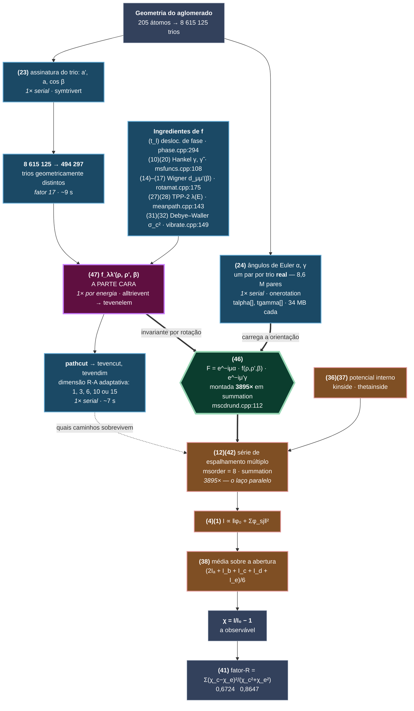

# MSCD_ATA_GPU — V0

Ponto de partida: **MSCD 1.37** (Yufeng Chen e Michel A. Van Hove, LBNL, 1997–98),
cálculo de difração e dicroísmo de fotoelétrons (XPD/PED) por espalhamento
múltiplo. C++98, 69 arquivos, ~19 mil linhas, paralelizado com MPI.

Esta tag `v0` é o código **como recebido**, compilando e rodando em g++ 13 /
Open MPI 4.1.6, reproduzindo a saída de referência. É a linha de base contra a
qual o port de GPU vai ser medido e validado.

> ### ⚠ Este documento descreve o estado V0. O código já andou.
>
> Desde 04/08/2026 o cluster de trabalho é **raio 9 / profundidade 20**
> (247 átomos), não o de profundidade 15 (205 átomos) que gerou **todos os
> números deste arquivo**. E o `symtrivert` foi reescrito: a varredura
> redundante `natoms³` da fase C não existe mais, a busca linear no balde virou
> hash, e os *selection sorts* viraram `std::sort`.
>
> **Medições atuais, versão por versão, e o que mudou no código:
> [`OTIMIZACAO.md`](OTIMIZACAO.md).** Critério de validação e linha de base
> congelada: [`baseline/README.md`](baseline/README.md).
>
> Resumo: `symtrivert` 20,87 → 1,59 s, total 70 → 48,4 s, curva idêntica byte a
> byte. **Tudo isso é otimização serial** — nenhum paralelismo novo foi
> introduzido; o laço dos 779 pontos continua exatamente como estava.
>
> O que continua valendo deste arquivo: a fatoração caro/barato da eq. (46), o
> grafo das equações, a descrição da arquitetura de paralelismo e as armadilhas.
> O que não vale mais: os tempos, as contagens de átomos e trios, e a descrição
> das fases do `symtrivert`.

## Compilar e rodar

```bash
make randmscd_parallel CPPFLAGS="-O3 -std=c++98 -w -fpermissive"
mpirun --use-hwthread-cpus -np 6 randmscd_parallel Cov0.txt
```

Resultado correto: `factors = 0.6724 0.8647`, curva em
`saida1Co-alterado-alexandre.txt`.

As duas flags não são preferência:

- **`-fpermissive`** — `fcomplex.h:46` declara
  `friend Fcomplex polar(float,float=0)`. Argumento padrão em `friend` que não é
  definição: ilegal no padrão, aceito pelos compiladores de 1998, recusado pelo
  g++ 13. É o único erro em 69 arquivos.
- **`--use-hwthread-cpus`** — o Open MPI conta núcleos *físicos* (6 num
  i5-13420H), não threads (12), e desde a série 3.x recusa superalocar em vez de
  aceitar calado como a 1.10 fazia. Sem ela, `-np` acima de 6 morre em
  "not enough slots".

O `makefile` constrói outros doze executáveis; só o `randmscd_parallel` interessa.

## Não é o MSCD 1.37 de fábrica: tem ATA

Este código carrega uma extensão **ATA** (*average t-matrix approximation*) que
não existe no MSCD original, para tratar ligas superficiais aleatórias
substituindo os espalhadores por uma matriz-t efetiva

    t = (1 − w)·t₁ + w·t₂

`Mscdrun::ATAevenelem` (`mscdrunc.cpp:45`) implementa a mistura, e ela entra em
`alltrievent` (`mscdrunc.cpp:222`) e `alldblevent` (`mscdrunc.cpp:779`) — isto é,
na montagem dos elementos de espalhamento, que é parte da fase **serial**, não do
laço por direção. A referência é Soares, de Siervo, Landers e Kleiman,
*Photoelectron diffraction from random surface alloys: critique of calculational
methods*, Surface Science **497** (2002) 205–213.

Liga-se pela linha do arquivo de entrada:

```
0       0.7     0.2     ATA, ATAWeight1, ATAWeight2
```

No `Cov0.txt` desta linha de base o ATA está **desligado** (`ATA=0`), de modo que
os números medidos abaixo são do caminho de cálculo comum.

## A fatoração que organiza o programa inteiro

> O **`EQUACOES.md`** mapeia as ~40 equações do manual (`MANUAL_MSCD_CEA.pdf`)
> para arquivo e linha, nos dois sentidos. Comece por lá antes de abrir qualquer
> `.cpp`: o código chama as coisas de `cxa`, `algam` e `tevenelem`; o manual
> chama de Γ, F e t_l, e nada nos dois liga um ao outro.

Há uma única ideia no centro do MSCD, e ela está na eq. (46) do manual (pág. 36).
A matriz de amplitude de espalhamento — o objeto que aparece uma vez para cada
trio (emissor, espalhador, receptor) em cada caminho de cada ordem — **se
fatora**:

$$F_{\lambda\lambda'}(\boldsymbol{\rho},\boldsymbol{\rho}') \;=\; \underbrace{e^{-i\mu\alpha}}_{\text{barato}} \;\cdot\; \underbrace{f_{\lambda\lambda'}(\rho,\rho',\beta)}_{\text{caro}} \;\cdot\; \underbrace{e^{-i\mu'\gamma}}_{\text{barato}}$$

com

$$f_{\lambda\lambda'}(\rho,\rho',\beta) \;=\; e^{-\frac{a'}{2\lambda} - k^2(1-\cos\beta)\sigma_c^2} \;\frac{e^{i\rho'}}{\rho'}\; \sum_l t_l \, \gamma^l_{\mu\alpha}(\rho) \, d^l_{\mu\mu'}(\beta) \, \tilde\gamma^l_{\mu'\nu'}(\rho')$$

O que distingue os dois lados **não é o tamanho da conta, é de que a conta
depende**:

| | depende de | quantos objetos distintos |
|---|---|---|
| **caro** — `f` | só dos dois comprimentos de ligação e do ângulo β entre eles | **494 297** |
| **barato** — as fases | dos ângulos de Euler α e γ, isto é, da **orientação absoluta** do par no espaço | 8 615 125 |

Gire um trio de átomos rigidamente no espaço: `f` não muda, só as fases mudam.
Como `f` carrega a soma sobre momento angular, as matrizes de Wigner, os
deslocamentos de fase `t_l`, o livre caminho médio e o Debye–Waller, e as fases
são uma exponencial de tabela — a assimetria de custo é enorme.

Daí sai **tudo**:

- **Por que existe uma fase serial gorda.** Alguém precisa varrer os 205³ = 8,6
  milhões de trios, reduzi-los às 494 297 assinaturas distintas e calcular `f`
  uma vez para cada. É o `symtrivert` + `precutable` + `alltrievent` — os ~16 s
  que não escalam com `-np`.
- **Por que ela é difundida, e não recalculada.** O resultado é uma tabela de
  ~190 MB. Cada rank recebe uma cópia inteira via `sendjobs`.
- **Por que o laço paralelo é barato por ponto.** Ele só aplica as fases e soma.
- **Por que o fator de economia é 17**, e não mais: é 8 615 125 / 494 297.

### O grafo das equações

Cada nó é uma equação do manual; a cor diz **quantas vezes ela roda**. A eq. (46)
é a fronteira: tudo à esquerda dela é pago uma vez, tudo à direita é pago 3895
vezes.



**Azul** = pago uma vez, serial, só no rank 0 — os ~16 s que não escalam.
**Roxo** = a parte cara, uma vez por energia. **Verde** = a fatoração.
**Laranja** = pago 3895 vezes, o laço paralelo.

Repare que **os dois lados da eq. (46) são pré-calculados na fase serial**: `f`
uma vez por assinatura distinta, os ângulos α e γ uma vez por trio real. O que
se repete 3895 vezes é só *montar* o produto e somar a série. Tudo que dava para
pré-calcular já foi pré-calculado em 1997 — é por isso que o laço quente é
limitado por banda de memória e não por aritmética, como as medições mostram.

O `EQUACOES.md` destrincha cada nó: a equação, o arquivo e a linha.

### O que isso diz para a GPU

A fronteira do grafo é a fronteira do trabalho. Do lado direito estão os 3895
solves independentes — é o que vale portar. Mas repare que o lado esquerdo
**não** é preparação trivial: são 16 s de `natoms³` com deduplicação por hash e
uma varredura de esparsidade, hoje inteiramente sequenciais. Com o laço a zero,
o programa ainda levaria esses 16 s.

E a eq. (46) impõe uma restrição concreta ao formato dos dados: `tevenelem`
(o lado caro) é indexado por **assinatura geométrica**, enquanto `talpha`/`tgamma`
(o lado barato) são indexados por **trio real**. São dois espaços de índice
diferentes, ligados pela indireção `tevenadd[ia][ib][ic]`. Todo acesso no laço
quente passa por essa indireção — é ela, e não a aritmética, que domina o tempo.

## O que o programa calcula

Entrada `Cov0.txt`: Ag(111) fcc, `natoms=205` átomos no aglomerado, `msorder=8`
(ordem máxima de espalhamento múltiplo), `raorder=4` (⇒ `radim=15`, dimensão da
expansão separável de Rehr–Albers), `linitial=1`, `lnum=10`.

A varredura é angular a módulo de k fixo:

```
dtheta 18…72 passo 3  →  19 valores
dphi  111…231 passo 3 →  41 valores
                         19 × 41 = 779 = npoint
```

Para cada uma das 779 direções de emissão (θ,φ) o código resolve a série de
espalhamento múltiplo e devolve a intensidade e a modulação
χ = I/I₀ − 1.

## Onde está o paralelo — e onde não está

**O paralelismo é sobre as 779 direções de emissão, e só sobre elas.**

O modelo é mestre–trabalhador com difusão do job (não divisão de domínio). A
fatia de cada rank sai de uma divisão estática em `Mscdrun::assistant`:

```cpp
// mscdrun.cpp:808
k = npoint/numpe;  m = npoint%numpe;
if (mype<m) { pdbeg=(k+1)*mype;          pdend=pdbeg+k+1; }
else        { pdbeg=(k+1)*m+k*(mype-m);  pdend=pdbeg+k;   }
```

e é consumida no único laço paralelo do programa:

```cpp
// mscdrund.cpp:221  —  Mscdrun::intensity
for (i=pdbeg; (error==0)&&(i<pdend); ++i)
{ ...
  for (k=0; k<5; ++k)                       // cone de aceitação, accepang=1.5°
  { thetainside(...);
    if (k==0) error=alldblevent(akin,xdetec);
    error=allevendetec(akin,xdetec);        // propagador do lado do detector
    error=summation(akin,xdetec,polaron,    // <-- a conta pesada
                    &suminten,&bakinten,asum,bsum,csum);
  }
}
```

São **779 × 5 = 3895 resoluções independentes** da série de espalhamento
múltiplo (5 sub-direções por ponto, para a média sobre o cone de aceitação de
1,5° do analisador; a central entra com peso dobrado).

`Mscdrun::summation` (`mscdrund.cpp:20`) é o núcleo: parte das amplitudes de
um espalhamento e itera a série

```cpp
for (m=msorder; m>=2; --m)      // 7 passadas para msorder=8
  for (ia<natoms) for (ib<natoms) for (ic<natoms)
    for (j<radim) for (k<radim)
      csum[j] += algam[t] * bsum[ib][ic][k] * tevenelem[mevadd + j*eegdim + k];
```

ou seja, sete produtos matriz-vetor esparsos sobre o espaço de caminhos
(emissor, espalhador₁, espalhador₂), com matrizes 15×15 por trio e
`algam = exp(i(−pγ − qα))` girando entre os referenciais locais. No fim, para
cada emissor e cada `m` de −l a +l, soma a onda espalhada com a onda direta e
eleva ao quadrado.

### O que **não** é paralelo

Todo o preparo geométrico está dentro de um `if (mype==0)` — literalmente:

```cpp
// mscdjob.cpp:397
if (mype==0)
{ mscdrun->init();
  error=mscdrun->readparameter();
  error=mscdrun->paradisp();
  error=mscdrun->symtrivert();    // <-- "Analyzing / Reanalyzing"
  error=mscdrun->symdblvert();
  error=mscdrun->precutable();
}
if ((error==0)&&(numpe>1)&&(mype==0)) error=mscdrun->sendjobs();
else if (numpe>1)                     error=mscdrun->receivejobs();
```

Enquanto isso os outros ranks estão parados dentro de `receivejobs()`. **Não é
que essa parte escale mal: ela não é paralela de forma alguma.** Aumentar `-np`
não pode ajudá-la nem em princípio.

O que cada etapa serial faz:

| etapa | o que calcula |
|---|---|
| `symtrivert` (`mscdrunb*.cpp:348`) | varre os `natoms³` = 8,6 milhões de trios de átomos, reduz cada um à assinatura (r₁, 1/r₂, cos β), deduplica e produz **494 297 trios geometricamente distintos**. "Reanalyzing" é o recomeço do zero quando um balde de hash estoura: `nsymm/=2` e volta ao início. Nesta entrada acontece 2 vezes. |
| `symdblvert` | o mesmo para pares: 28 470 duplas distintas |
| `precutable` (`mscdrunc.cpp:285`) | coeficientes vibracionais, matrizes de rotação, expansão esférica (Hankel), `alltrievent(1,kmin)` para os elementos de matriz de espalhamento, e a varredura `msorder × natoms³` que monta as máscaras de esparsidade `tevencut`/`tevendim` do `pathcut` |
| `sendjobs` (`mscdrun.cpp:502`) | serializa o job inteiro (**~190 MB**) e o envia **num laço sequencial de `mpisend` ponto a ponto**, rank por rank — não há `MPI_Bcast`. Custo ∝ `numpe`. |

## Medições

i5-13420H (6 núcleos físicos / 12 threads), Open MPI 4.1.6, g++ 13,
`-O3 -std=c++98`. Build instrumentado com marcadores de fase, saída redirecionada
para arquivo (imprimir no terminal custa ~10 s no total). Todos os `-np`
reproduzem `factors = 0.6724 0.8647`.

| `-np` | preparo serial | laço dos 779 pontos | total | speedup do laço | speedup total |
|------:|---------------:|--------------------:|------:|----------------:|--------------:|
| 1  | 15,6 s | 84,2 s | **99,8 s** | 1,00× | 1,00× |
| 2  | 14,8 s | 41,9 s | **56,9 s** | 2,01× | 1,75× |
| 6  | 16,1 s | 25,0 s | **41,4 s** | 3,37× | 2,41× |
| 10 | 22,0 s | 21,9 s | **44,0 s** | 3,84× | 2,27× |

Detalhe do preparo serial (rank 0):

| `-np` | `symtrivert` | `symdblvert` | `precutable` | `sendjobs` |
|------:|---:|---:|---:|---:|
| 1  |  9,4 s | 0,4 s | 5,7 s |    — |
| 6  |  7,4 s | 0,5 s | 7,2 s | 0,6 s |
| 10 | 11,2 s | 0,5 s | 8,4 s | 1,1 s |

O próprio programa concorda. Com `dispmode` no dígito 5 ele emite em
`mscdlist.txt` a distribuição de tempo por processador (`-np 6`):

```
 pid computation   sending  receiving      idle comput send receiv  idle
   0  4.200e+01  1.000e+00  0.000e+00  0.000e+00  97.7   2.3   0.0   0.0
   1  2.500e+01  1.000e+00  0.000e+00  1.700e+01  58.1   2.3   0.0  39.5
   2  2.500e+01  1.000e+00  0.000e+00  1.700e+01  58.1   2.3   0.0  39.5
   3  2.400e+01  1.000e+00  1.000e+00  1.700e+01  55.8   2.3   2.3  39.5
   4  2.500e+01  0.000e+00  1.000e+00  1.700e+01  58.1   0.0   2.3  39.5
   5  2.500e+01  0.000e+00  1.000e+00  1.700e+01  58.1   0.0   2.3  39.5
 sum  1.660e+02  4.000e+00  3.000e+00  8.500e+01  64.3   1.6   1.2  32.9
```

O rank 0 nunca fica ocioso; cada trabalhador fica **17 s parado** — exatamente
o preparo serial que ele atravessa sem ter o que fazer. Um terço de todo o
tempo-processador da máquina vai embora esperando.

Três coisas saem daí:

1. **`-np 10` é mais lento que `-np 6`** nesta máquina. O laço paralelo ganha
   pouco (3,37× → 3,84×) e o preparo serial *piora* 6 s.
2. **Por que o preparo piora com mais ranks.** Amostrando os processos aos 8 s,
   no meio do `symtrivert`: rank 0 a 100% de CPU com 51 MB residentes; os nove
   trabalhadores a 92–98% de CPU com 15 MB — ainda não receberam o job de 190 MB,
   isto é, **queimam um núcleo cada um sem fazer nada**, girando na espera
   ocupada do `MPI_Recv` do Open MPI. Em 6 núcleos físicos, o rank 0 fica com
   ~60% de um núcleo. Testado e sem efeito: `--mca mpi_yield_when_idle 1` (59,3 s)
   e `--oversubscribe` (52,9 s, pior). O remédio que funciona é usar `-np 6`.
3. **Teto de Amdahl.** A fração serial em `-np 1` é 15,6/99,8 = **15,6%** ⇒
   speedup máximo 6,4×, por mais núcleos que se jogue no problema.

## O que isso significa para o port de GPU

O alvo natural é `summation` + `allevendetec`: 3895 resoluções independentes,
sem comunicação entre elas, cada uma um encadeamento de produtos matriz-vetor
esparsos com blocos 15×15 complexos. É a forma que a GPU gosta.

Duas ressalvas que as medições impõem:

- **O laço já é limitado por memória, não por aritmética.** De 1 para 6 ranks o
  ganho é 3,37×, não ~6×, com o conjunto de trabalho em ~190 MB por rank —
  muito além de qualquer cache. Isso é bom sinal para GPU (largura de banda é
  justamente o que ela tem de sobra), mas significa que o ganho vai vir do
  arranjo de memória de `tevenelem`/`tevenadd`, não de mais FLOPs.
- **Os 15,6 s de preparo serial viram o gargalo seguinte.** Se o laço fosse a
  zero, o programa ainda levaria 15,6 s — 5,7 s dos quais em `precutable` e 9,4 s
  em `symtrivert`, que é uma varredura `natoms³` com deduplicação por hash,
  igualmente paralelizável mas hoje inteiramente sequencial.

## Armadilhas do código

- **O `makefile` linka `mscdrunb_not_reanalize.o`, não `mscdrunb.o`.** O binário
  em uso é a variante modificada pelo Abner, que afrouxou a tolerância de
  deduplicação geométrica de 0,001 para 0,005 Å (e o limiar `natoms>100` para
  `>333`). `diff mscdrunb.cpp mscdrunb_not_reanalize.cpp` mostra tudo. Editar
  `mscdrunb.cpp` não tem efeito nenhum no executável.
- **`usercomp.cpp` e `usert3e.cpp` são cópias byte a byte do `userCluster.cpp`.**
  Os nomes sugerem variantes de plataforma; não são. Toda chamada MPI do código
  de física passa por essa camada fina (`mpisend`, `mpireceive`, `mpigetmype`…),
  e foi ela que permitiu trocar de versão de MPI sem tocar em cálculo nenhum.
- **`pgrep -x randmscd_parallel` dá 0 com o programa rodando** — o kernel trunca
  `/proc/PID/comm` em 15 caracteres e o nome tem 18. Use `pgrep -f`.
- **Sem alvo `clean` no `makefile`.** Para recompilar de verdade, tire os `.o`
  do caminho à mão.
- **O `dispmode` do arquivo de entrada é um número de dois dígitos.** As dezenas
  ligam o log em `mscdlist.txt` (`displog=dispjob/10`), as unidades são o nível
  de exibição (`mscdjob.cpp:226-230`). O `10` do `Cov0.txt` é portanto
  exibição 0 + log ligado. O manual (seção da versão 1.24) manda "set display
  mode to 10" para ligar o relatório de tempo por processador; nesta versão isso
  não basta — é preciso **15**, e aí `dispmode>4` também liga um `waitenter()`
  (`mscdjob.cpp:382`) que bloqueia esperando Enter, inclusive com stdin em
  `/dev/null`. Para rodar não interativo: `yes "" | mpirun …`.
- **`numpe > npoint` é erro 761** (`mscdruna.cpp:492`): não dá para ter mais
  ranks que pontos de varredura.
